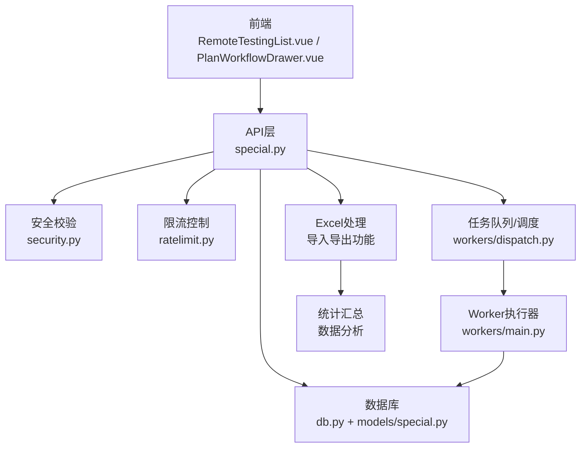
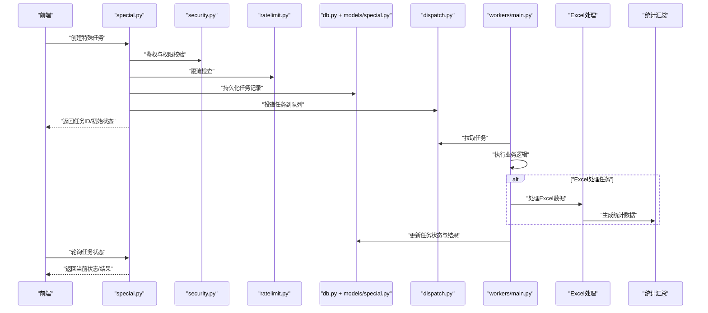
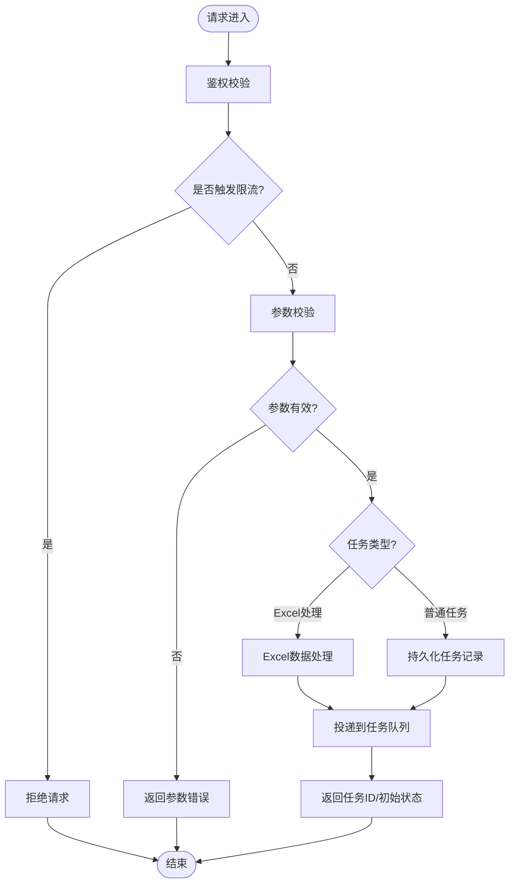
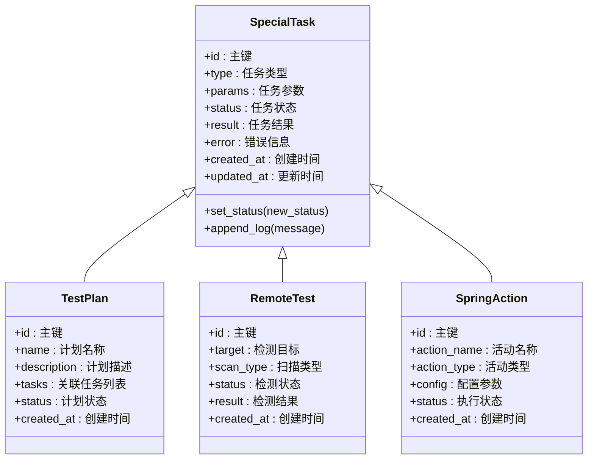
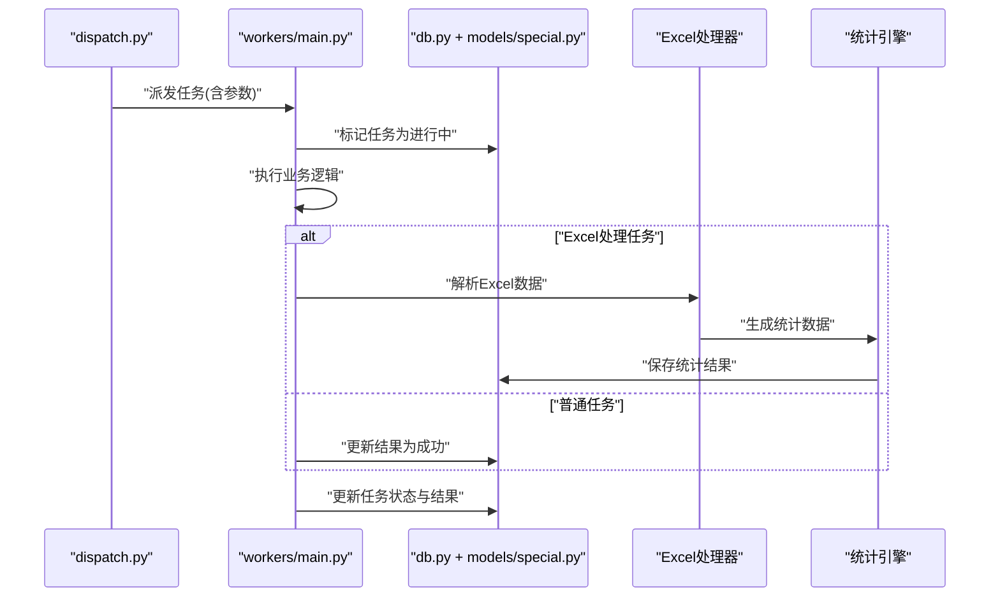
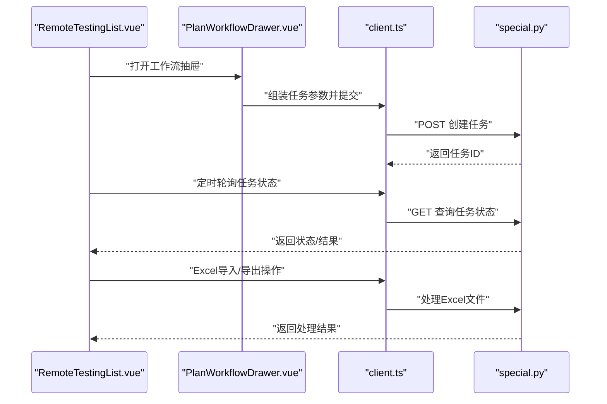
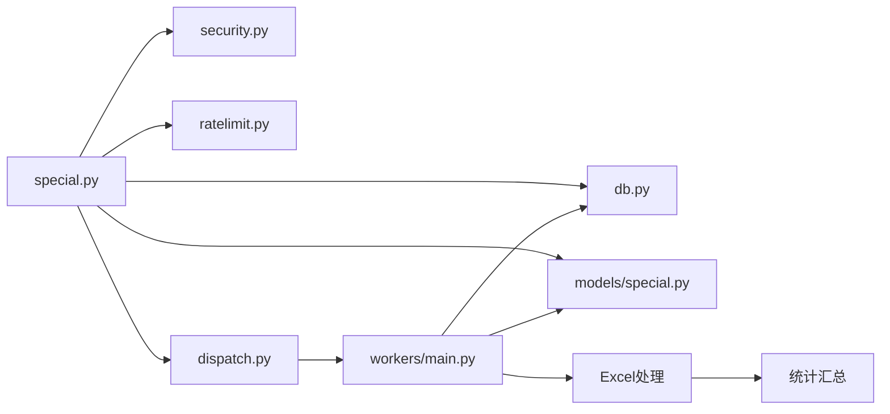

# 特殊任务工作流

<cite>
**本文引用的文件**   
- [backend/app/api/v1/special.py](file://backend/app/api/v1/special.py)
- [backend/app/models/special.py](file://backend/app/models/special.py)
- [backend/app/workers/main.py](file://backend/app/workers/main.py)
- [backend/app/workers/dispatch.py](file://backend/app/workers/dispatch.py)
- [backend/app/db.py](file://backend/app/db.py)
- [backend/app/core/config.py](file://backend/app/core/config.py)
- [backend/app/core/security.py](file://backend/app/core/security.py)
- [backend/app/core/ratelimit.py](file://backend/app/core/ratelimit.py)
- [backend/app/schemas.py](file://backend/app/schemas.py)
- [frontend/src/views/RemoteTestingList.vue](file://frontend/src/views/RemoteTestingList.vue)
- [frontend/src/components/PlanWorkflowDrawer.vue](file://frontend/src/components/PlanWorkflowDrawer.vue)
- [frontend/src/api/client.ts](file://frontend/src/api/client.ts)
</cite>

## 更新摘要
**变更内容**   
- 新增测试计划管理功能，支持计划的创建、编辑和状态管理
- 新增远程检测模块，提供远程安全检测任务的完整工作流
- 新增Spring Action活动管理，支持自动化活动的编排和执行
- 增强Excel导入导出功能，支持批量数据操作和统计汇总
- 完善前端界面，新增相关视图组件和交互逻辑

## 目录
1. [简介](#简介)
2. [项目结构](#项目结构)
3. [核心组件](#核心组件)
4. [架构总览](#架构总览)
5. [详细组件分析](#详细组件分析)
6. [依赖关系分析](#依赖关系分析)
7. [性能考虑](#性能考虑)
8. [故障排查指南](#故障排查指南)
9. [结论](#结论)
10. [附录](#附录) 

## 简介
本文件围绕"特殊任务工作流"展开，聚焦后端特殊任务接口、模型与异步执行器（Worker）之间的协作，以及前端在远程测试与计划工作流中的交互。本次更新新增了测试计划管理、远程检测、Spring Action活动和Excel导入导出等核心功能，目标是帮助读者快速理解从请求进入、任务调度、持久化到结果回传的完整链路，并给出常见问题定位与优化建议。

## 项目结构
与"特殊任务工作流"直接相关的代码主要分布在以下模块：
- 后端 API：special.py 暴露特殊任务相关接口，包括测试计划、远程检测和Spring Action管理
- 数据模型：models/special.py 定义特殊任务实体，包含测试计划、远程检测任务和Spring Action的字段
- 异步执行：workers/main.py 与 workers/dispatch.py 负责任务队列与分发
- 数据库与配置：db.py、core/config.py 提供连接与运行时配置
- 安全与限流：core/security.py、core/ratelimit.py 保障接口安全与稳定性
- 前端视图：RemoteTestingList.vue、PlanWorkflowDrawer.vue 用于远程测试与工作流编排
- 前端 API 客户端：client.ts 封装对后端的调用

**图表来源** 
- [backend/app/api/v1/special.py](file://backend/app/api/v1/special.py)
- [backend/app/models/special.py](file://backend/app/models/special.py)
- [backend/app/workers/main.py](file://backend/app/workers/main.py)
- [backend/app/workers/dispatch.py](file://backend/app/workers/dispatch.py)
- [backend/app/db.py](file://backend/app/db.py)
- [backend/app/core/security.py](file://backend/app/core/security.py)
- [backend/app/core/ratelimit.py](file://backend/app/core/ratelimit.py)

**章节来源**
- [backend/app/api/v1/special.py](file://backend/app/api/v1/special.py)
- [backend/app/models/special.py](file://backend/app/models/special.py)
- [backend/app/workers/main.py](file://backend/app/workers/main.py)
- [backend/app/workers/dispatch.py](file://backend/app/workers/dispatch.py)
- [backend/app/db.py](file://backend/app/db.py)
- [backend/app/core/config.py](file://backend/app/core/config.py)
- [backend/app/core/security.py](file://backend/app/core/security.py)
- [backend/app/core/ratelimit.py](file://backend/app/core/ratelimit.py)
- [frontend/src/views/RemoteTestingList.vue](file://frontend/src/views/RemoteTestingList.vue)
- [frontend/src/components/PlanWorkflowDrawer.vue](file://frontend/src/components/PlanWorkflowDrawer.vue)
- [frontend/src/api/client.ts](file://frontend/src/api/client.ts)

## 核心组件
- 特殊任务接口层（special.py）
  - 职责：接收前端请求，进行参数校验、鉴权与限流，将任务写入持久化或投递至任务队列，返回任务状态或ID供前端轮询。
  - 关键流程：鉴权 -> 限流 -> 参数校验 -> 落库/入队 -> 响应。
  - **新增**：支持测试计划CRUD、远程检测任务管理、Spring Action活动管理、Excel批量导入导出。
- 特殊任务模型（models/special.py）
  - 职责：定义特殊任务的字段、约束与关联关系，支撑查询、更新与审计。
  - **新增**：扩展了测试计划、远程检测任务、Spring Action的实体定义和关联关系。
- Worker 执行器（workers/main.py）
  - 职责：消费任务队列中的特殊任务，执行业务逻辑（如远程测试、报告生成等），更新任务状态与结果。
  - **新增**：支持Excel数据处理、统计分析和自动化活动执行。
- 任务调度器（workers/dispatch.py）
  - 职责：将新任务按策略分发给合适的 Worker，处理重试、超时与失败回调。
- 数据库与配置（db.py、core/config.py）
  - 职责：管理数据库连接、会话生命周期；加载运行期配置（如队列地址、并发度、超时等）。
- 安全与限流（core/security.py、core/ratelimit.py）
  - 职责：鉴权、权限校验、访问频率限制，防止滥用与资源耗尽。
- 前端交互（RemoteTestingList.vue、PlanWorkflowDrawer.vue、client.ts）
  - 职责：发起特殊任务创建、查询进度、展示结果；在工作流抽屉中编排步骤与参数。
  - **新增**：测试计划管理界面、远程检测任务列表、Spring Action活动管理界面。

**章节来源**
- [backend/app/api/v1/special.py](file://backend/app/api/v1/special.py)
- [backend/app/models/special.py](file://backend/app/models/special.py)
- [backend/app/workers/main.py](file://backend/app/workers/main.py)
- [backend/app/workers/dispatch.py](file://backend/app/workers/dispatch.py)
- [backend/app/db.py](file://backend/app/db.py)
- [backend/app/core/config.py](file://backend/app/core/config.py)
- [backend/app/core/security.py](file://backend/app/core/security.py)
- [backend/app/core/ratelimit.py](file://backend/app/core/ratelimit.py)
- [frontend/src/views/RemoteTestingList.vue](file://frontend/src/views/RemoteTestingList.vue)
- [frontend/src/components/PlanWorkflowDrawer.vue](file://frontend/src/components/PlanWorkflowDrawer.vue)
- [frontend/src/api/client.ts](file://frontend/src/api/client.ts)

## 架构总览
特殊任务工作流采用"API + 异步Worker"的解耦架构，本次更新增强了Excel处理和统计分析能力：
- 前端通过 client.ts 调用 special.py 提供的接口创建任务或查询状态。
- special.py 完成鉴权与限流后，将任务持久化并投递至 dispatch.py 管理的队列。
- workers/main.py 拉取任务并执行，完成后写回数据库，前端可轮询获取最终结果。
- **新增**：Excel导入导出模块支持批量数据处理，统计汇总模块提供数据分析能力。

**图表来源** 
- [backend/app/api/v1/special.py](file://backend/app/api/v1/special.py)
- [backend/app/core/security.py](file://backend/app/core/security.py)
- [backend/app/core/ratelimit.py](file://backend/app/core/ratelimit.py)
- [backend/app/db.py](file://backend/app/db.py)
- [backend/app/models/special.py](file://backend/app/models/special.py)
- [backend/app/workers/dispatch.py](file://backend/app/workers/dispatch.py)
- [backend/app/workers/main.py](file://backend/app/workers/main.py)

## 详细组件分析

### 特殊任务接口层（special.py）
- 设计要点
  - 统一入口：所有特殊任务操作均通过该模块暴露 REST 接口。
  - 安全与限流：集成 security.py 与 ratelimit.py，确保只有合法用户且未超频的请求进入业务逻辑。
  - 异步解耦：创建任务后立即返回任务ID，避免阻塞HTTP请求。
  - 状态同步：提供查询接口，支持前端轮询任务进度与结果。
  - **新增**：Excel导入导出接口、统计汇总接口、测试计划管理接口。
- 典型流程
  - 鉴权 -> 限流 -> 参数校验 -> 写入任务表 -> 投递队列 -> 返回任务ID
  - 查询接口读取任务表最新状态并返回
  - **新增**：Excel批量处理 -> 数据验证 -> 批量入库 -> 生成统计报告

**图表来源** 
- [backend/app/api/v1/special.py](file://backend/app/api/v1/special.py)
- [backend/app/core/security.py](file://backend/app/core/security.py)
- [backend/app/core/ratelimit.py](file://backend/app/core/ratelimit.py)

**章节来源**
- [backend/app/api/v1/special.py](file://backend/app/api/v1/special.py)
- [backend/app/core/security.py](file://backend/app/core/security.py)
- [backend/app/core/ratelimit.py](file://backend/app/core/ratelimit.py)

### 特殊任务模型（models/special.py）
- 设计要点
  - 字段设计：包含任务标识、类型、参数、状态、错误信息、创建/更新时间等。
  - 状态机：定义任务生命周期（如待处理、进行中、成功、失败、取消）。
  - 关联关系：与资产、报告或其他业务实体建立外键关联，便于追溯。
  - **新增**：测试计划模型、远程检测任务模型、Spring Action活动模型的字段定义和关联关系。
- 复杂度与索引
  - 高频查询字段（如状态、类型、创建时间）应建立索引以提升查询性能。
  - 大字段（如日志、结果）建议分页或延迟加载。
  - **新增**：Excel导入数据的临时存储和统计结果的缓存机制。

**图表来源** 
- [backend/app/models/special.py](file://backend/app/models/special.py)

**章节来源**
- [backend/app/models/special.py](file://backend/app/models/special.py)

### 任务调度与执行（dispatch.py 与 workers/main.py）
- 调度器（dispatch.py）
  - 职责：维护任务队列，按策略（如优先级、标签、负载）分派给 Worker。
  - 特性：支持重试、超时、死信队列与失败回调。
  - **新增**：Excel处理任务优先级、统计任务批量处理能力。
- 执行器（workers/main.py）
  - 职责：拉取任务、执行业务逻辑、更新状态与结果、处理异常。
  - 特性：可配置并发度、健康检查、优雅退出。
  - **新增**：Excel数据解析、批量数据处理、统计分析报告生成。

**图表来源** 
- [backend/app/workers/dispatch.py](file://backend/app/workers/dispatch.py)
- [backend/app/workers/main.py](file://backend/app/workers/main.py)
- [backend/app/db.py](file://backend/app/db.py)
- [backend/app/models/special.py](file://backend/app/models/special.py)

**章节来源**
- [backend/app/workers/dispatch.py](file://backend/app/workers/dispatch.py)
- [backend/app/workers/main.py](file://backend/app/workers/main.py)
- [backend/app/db.py](file://backend/app/db.py)
- [backend/app/models/special.py](file://backend/app/models/special.py)

### 前端工作流（RemoteTestingList.vue 与 PlanWorkflowDrawer.vue）
- RemoteTestingList.vue
  - 功能：列表展示远程测试任务，支持创建、刷新、查看状态与结果。
  - 交互：通过 client.ts 调用 special.py 接口，轮询任务状态直至完成。
  - **新增**：测试计划管理界面、Spring Action活动管理界面、Excel导入导出按钮。
- PlanWorkflowDrawer.vue
  - 功能：以抽屉形式编排任务步骤，设置参数与依赖关系，提交后由后端异步执行。
  - 交互：表单校验、批量提交、进度反馈与错误提示。
  - **新增**：测试计划创建向导、远程检测参数配置、Spring Action活动编排。

**图表来源** 
- [frontend/src/views/RemoteTestingList.vue](file://frontend/src/views/RemoteTestingList.vue)
- [frontend/src/components/PlanWorkflowDrawer.vue](file://frontend/src/components/PlanWorkflowDrawer.vue)
- [frontend/src/api/client.ts](file://frontend/src/api/client.ts)
- [backend/app/api/v1/special.py](file://backend/app/api/v1/special.py)

**章节来源**
- [frontend/src/views/RemoteTestingList.vue](file://frontend/src/views/RemoteTestingList.vue)
- [frontend/src/components/PlanWorkflowDrawer.vue](file://frontend/src/components/PlanWorkflowDrawer.vue)
- [frontend/src/api/client.ts](file://frontend/src/api/client.ts)
- [backend/app/api/v1/special.py](file://backend/app/api/v1/special.py)

## 依赖关系分析
- 耦合与内聚
  - special.py 与 security.py、ratelimit.py 低耦合，通过中间件或装饰器注入能力。
  - workers/main.py 与 dispatch.py 通过队列协议通信，降低直接依赖。
  - models/special.py 被 API 与 Worker 共同使用，保持数据一致性。
  - **新增**：Excel处理模块与统计模块的松耦合设计。
- 外部依赖
  - 数据库驱动（由 db.py 抽象）、消息队列（由 dispatch.py 抽象）、缓存（可选）。
  - **新增**：Excel处理库、统计分析库、文件上传下载服务。
- 潜在循环依赖
  - 确保 API 不直接依赖 Worker 实现，仅通过队列协议交互。
  - **新增**：Excel处理与统计模块之间无循环依赖。

**图表来源** 
- [backend/app/api/v1/special.py](file://backend/app/api/v1/special.py)
- [backend/app/core/security.py](file://backend/app/core/security.py)
- [backend/app/core/ratelimit.py](file://backend/app/core/ratelimit.py)
- [backend/app/db.py](file://backend/app/db.py)
- [backend/app/models/special.py](file://backend/app/models/special.py)
- [backend/app/workers/dispatch.py](file://backend/app/workers/dispatch.py)
- [backend/app/workers/main.py](file://backend/app/workers/main.py)

**章节来源**
- [backend/app/api/v1/special.py](file://backend/app/api/v1/special.py)
- [backend/app/core/security.py](file://backend/app/core/security.py)
- [backend/app/core/ratelimit.py](file://backend/app/core/ratelimit.py)
- [backend/app/db.py](file://backend/app/db.py)
- [backend/app/models/special.py](file://backend/app/models/special.py)
- [backend/app/workers/dispatch.py](file://backend/app/workers/dispatch.py)
- [backend/app/workers/main.py](file://backend/app/workers/main.py)

## 性能考虑
- 数据库层面
  - 为常用查询字段（状态、类型、时间范围）建立索引。
  - 大字段（结果、日志）采用分表或对象存储，减少主表体积。
  - **新增**：Excel临时数据表的索引优化，统计结果缓存机制。
- 队列与并发
  - 合理设置 Worker 并发度，避免 CPU/IO 争用。
  - 引入任务优先级与批处理，提升吞吐。
  - **新增**：Excel处理任务的优先级队列，批量处理的并发控制。
- 前端轮询
  - 使用指数退避策略，避免频繁请求造成压力。
  - 长轮询或 WebSocket 替代短轮询，降低延迟与开销。
- 限流与熔断
  - 针对热点接口实施细粒度限流，保护系统稳定。
  - 对下游依赖（如外部服务）增加熔断与降级策略。
  - **新增**：Excel导入导出的速率限制，大数据量处理的超时保护。

## 故障排查指南
- 常见症状
  - 任务长时间处于"进行中"：检查 Worker 是否存活、队列是否堆积、是否存在阻塞逻辑。
  - 任务频繁失败：查看错误日志、重试次数、死信队列。
  - 前端无法获取结果：确认轮询接口是否正常、鉴权是否过期、跨域与网络问题。
  - **新增**：Excel导入失败、统计结果不准确、内存溢出等问题。
- 定位步骤
  - 通过任务ID查询数据库记录，核对状态与错误信息。
  - 检查 Worker 日志与队列监控，确认消费与处理情况。
  - 验证鉴权与限流配置，排除因权限或频率导致的拒绝。
  - **新增**：检查Excel文件格式、数据完整性、统计计算逻辑。
- 恢复措施
  - 重启 Worker 或扩容实例。
  - 清理死信队列并重试失败任务。
  - 调整限流阈值与超时配置。
  - **新增**：清理临时Excel文件、重置统计缓存、优化内存使用。

**章节来源**
- [backend/app/api/v1/special.py](file://backend/app/api/v1/special.py)
- [backend/app/workers/main.py](file://backend/app/workers/main.py)
- [backend/app/workers/dispatch.py](file://backend/app/workers/dispatch.py)
- [backend/app/models/special.py](file://backend/app/models/special.py)
- [backend/app/core/security.py](file://backend/app/core/security.py)
- [backend/app/core/ratelimit.py](file://backend/app/core/ratelimit.py)

## 结论
特殊任务工作流通过"API + 异步Worker"的架构实现了高可用与可扩展性。本次更新新增了测试计划管理、远程检测、Spring Action活动和Excel导入导出等核心功能，前后端协作清晰，数据一致性与状态同步可靠。建议在后续迭代中加强监控告警、完善重试与补偿机制，并持续优化数据库与队列性能，以支撑更大规模的任务处理。特别是Excel大数据处理和统计分析功能的性能优化，将是未来重点关注的方向。

## 附录
- 配置项参考（示例）
  - 队列地址、Worker 并发度、任务超时、重试次数、限流阈值等。
  - **新增**：Excel文件大小限制、临时文件路径、统计缓存配置。
- 最佳实践
  - 任务幂等设计、错误码规范、日志结构化、灰度发布与回滚策略。
  - **新增**：Excel数据验证规范、批量处理的最佳实践、统计计算的准确性保证。
- 新功能使用说明
  - 测试计划管理：支持计划的创建、编辑、删除和状态跟踪。
  - 远程检测：提供多种检测类型的远程安全扫描功能。
  - Spring Action活动：支持自动化活动的编排和定时执行。
  - Excel导入导出：支持批量数据导入、格式转换和统计报告生成。