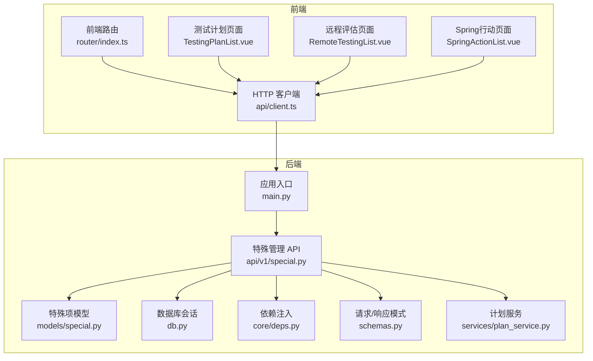
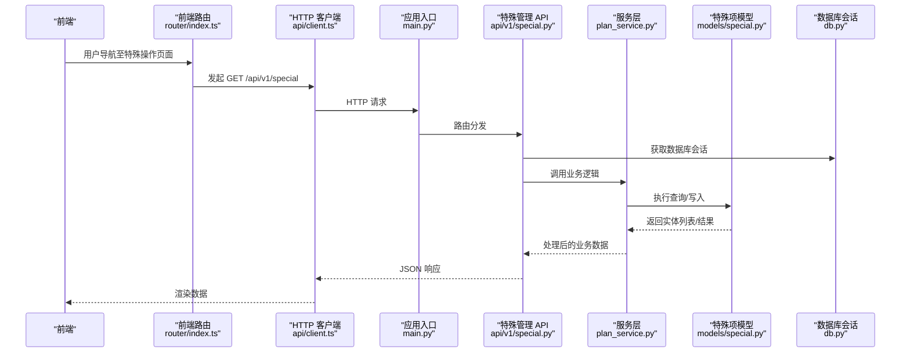
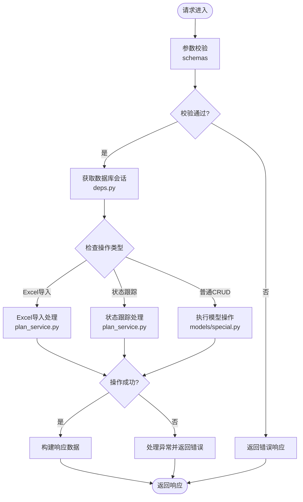
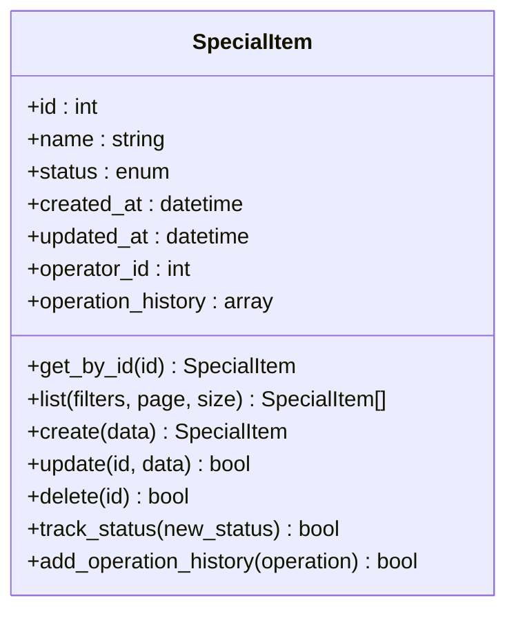
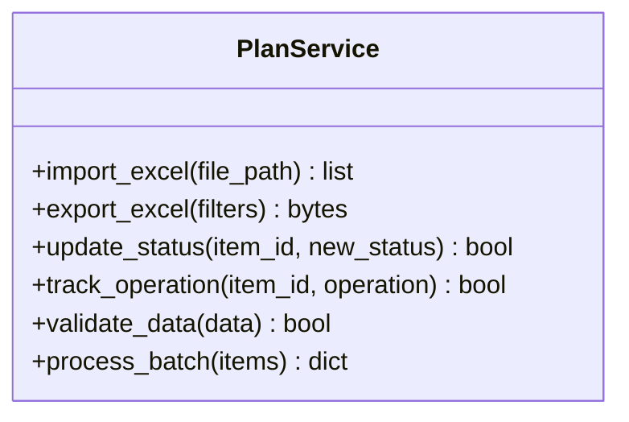
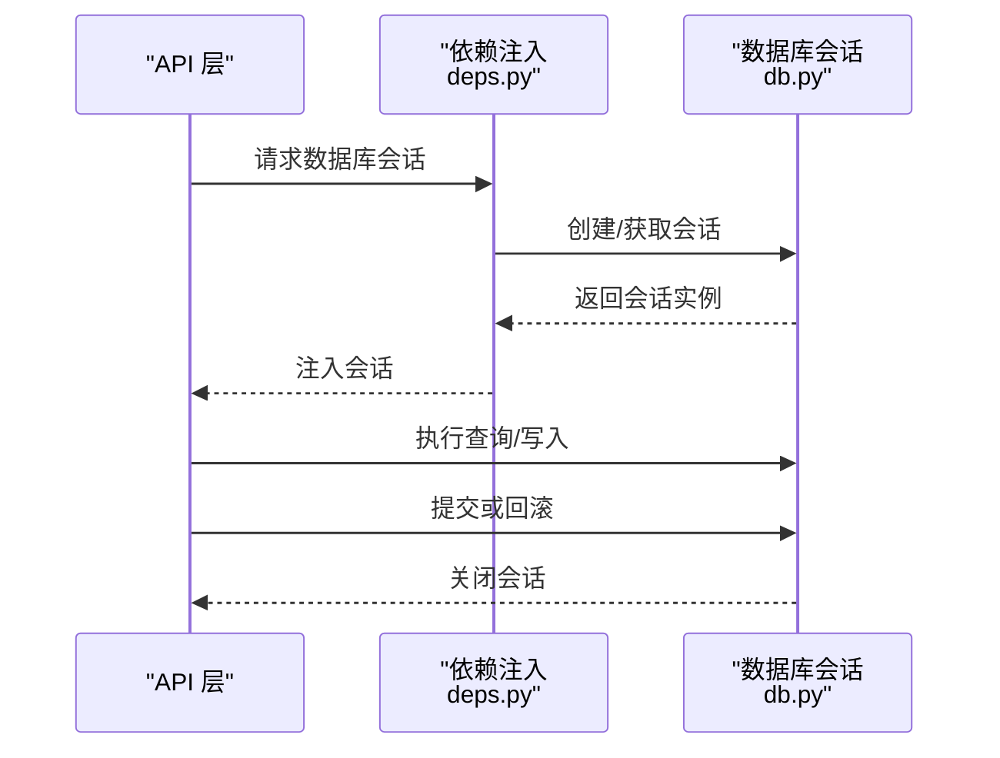
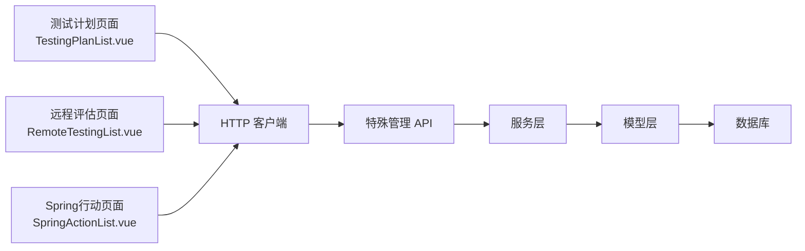
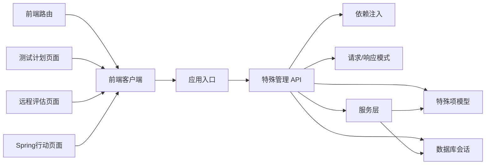

# 特殊管理模块

<cite>
**本文引用的文件**   
- [backend/app/api/v1/special.py](file://backend/app/api/v1/special.py)
- [backend/app/models/special.py](file://backend/app/models/special.py)
- [backend/app/db.py](file://backend/app/db.py)
- [backend/app/main.py](file://backend/app/main.py)
- [backend/app/core/deps.py](file://backend/app/core/deps.py)
- [backend/app/schemas.py](file://backend/app/schemas.py)
- [frontend/src/router/index.ts](file://frontend/src/router/index.ts)
- [frontend/src/api/client.ts](file://frontend/src/api/client.ts)
- [frontend/src/views/TestingPlanList.vue](file://frontend/src/views/TestingPlanList.vue)
- [frontend/src/views/RemoteTestingList.vue](file://frontend/src/views/RemoteTestingList.vue)
- [frontend/src/views/SpringActionList.vue](file://frontend/src/views/SpringActionList.vue)
- [backend/app/services/plan_service.py](file://backend/app/services/plan_service.py)
</cite>

## 更新摘要
**所做更改**   
- 新增特殊操作模块，支持测试计划、远程评估和Spring行动三种操作类型
- 集成Excel导入导出功能，支持批量数据操作
- 实现状态跟踪机制，支持团队协作工作流
- 扩展前端界面，提供专门的操作管理页面
- 增强后端服务层，支持复杂业务逻辑处理

## 目录
1. [简介](#简介)
2. [项目结构](#项目结构)
3. [核心组件](#核心组件)
4. [架构总览](#架构总览)
5. [详细组件分析](#详细组件分析)
6. [依赖分析](#依赖分析)
7. [性能考虑](#性能考虑)
8. [故障排查指南](#故障排查指南)
9. [结论](#结论)
10. [附录](#附录)

## 简介
本章节概述"特殊管理模块"的目标与范围。该模块围绕后端 API、数据模型与前端路由/客户端进行协作，提供对"特殊项"的增删改查能力，并集成数据库访问与依赖注入机制，确保前后端一致的数据契约与稳定的接口行为。

**更新** 新增特殊操作模块，支持测试计划、远程评估和Spring行动三种操作类型，包含Excel导入导出、状态跟踪和团队协作功能。

## 项目结构
"特殊管理模块"涉及以下关键位置：
- 后端 API：special.py（路由与控制器）
- 数据模型：special.py（ORM 模型定义）
- 数据库会话与连接：db.py
- 应用启动与路由注册：main.py
- 依赖注入：deps.py
- 请求/响应模式：schemas.py
- 前端路由：router/index.ts
- 前端 HTTP 客户端：api/client.ts
- 服务层：plan_service.py（业务逻辑处理）
- 前端视图：TestingPlanList.vue、RemoteTestingList.vue、SpringActionList.vue

**图示来源** 
- [backend/app/main.py](file://backend/app/main.py)
- [backend/app/api/v1/special.py](file://backend/app/api/v1/special.py)
- [backend/app/models/special.py](file://backend/app/models/special.py)
- [backend/app/db.py](file://backend/app/db.py)
- [backend/app/core/deps.py](file://backend/app/core/deps.py)
- [backend/app/schemas.py](file://backend/app/schemas.py)
- [backend/app/services/plan_service.py](file://backend/app/services/plan_service.py)
- [frontend/src/router/index.ts](file://frontend/src/router/index.ts)
- [frontend/src/api/client.ts](file://frontend/src/api/client.ts)
- [frontend/src/views/TestingPlanList.vue](file://frontend/src/views/TestingPlanList.vue)
- [frontend/src/views/RemoteTestingList.vue](file://frontend/src/views/RemoteTestingList.vue)
- [frontend/src/views/SpringActionList.vue](file://frontend/src/views/SpringActionList.vue)

**章节来源**
- [backend/app/api/v1/special.py](file://backend/app/api/v1/special.py)
- [backend/app/models/special.py](file://backend/app/models/special.py)
- [backend/app/db.py](file://backend/app/db.py)
- [backend/app/main.py](file://backend/app/main.py)
- [backend/app/core/deps.py](file://backend/app/core/deps.py)
- [backend/app/schemas.py](file://backend/app/schemas.py)
- [backend/app/services/plan_service.py](file://backend/app/services/plan_service.py)
- [frontend/src/router/index.ts](file://frontend/src/router/index.ts)
- [frontend/src/api/client.ts](file://frontend/src/api/client.ts)
- [frontend/src/views/TestingPlanList.vue](file://frontend/src/views/TestingPlanList.vue)
- [frontend/src/views/RemoteTestingList.vue](file://frontend/src/views/RemoteTestingList.vue)
- [frontend/src/views/SpringActionList.vue](file://frontend/src/views/SpringActionList.vue)

## 核心组件
- 特殊项 API（路由与控制器）：负责接收请求、参数校验、调用服务层或模型层、返回统一响应。
- 特殊项模型（ORM）：定义数据库表结构与字段约束，提供查询与更新方法。
- 数据库会话：通过依赖注入提供会话实例，保证事务边界与资源释放。
- 依赖注入：集中管理数据库会话、配置等共享对象。
- 请求/响应模式：定义 Pydantic 模型以校验输入与序列化输出。
- 服务层：处理复杂业务逻辑，如Excel导入导出、状态跟踪等。
- 前端路由与客户端：将页面路由映射到 API 调用，封装统一的 HTTP 请求逻辑。
- 专用页面组件：测试计划、远程评估、Spring行动的专门管理界面。

**更新** 新增服务层组件和专用页面组件，支持复杂的业务操作和用户体验。

**章节来源**
- [backend/app/api/v1/special.py](file://backend/app/api/v1/special.py)
- [backend/app/models/special.py](file://backend/app/models/special.py)
- [backend/app/db.py](file://backend/app/db.py)
- [backend/app/core/deps.py](file://backend/app/core/deps.py)
- [backend/app/schemas.py](file://backend/app/schemas.py)
- [backend/app/services/plan_service.py](file://backend/app/services/plan_service.py)
- [frontend/src/router/index.ts](file://frontend/src/router/index.ts)
- [frontend/src/api/client.ts](file://frontend/src/api/client.ts)
- [frontend/src/views/TestingPlanList.vue](file://frontend/src/views/TestingPlanList.vue)
- [frontend/src/views/RemoteTestingList.vue](file://frontend/src/views/RemoteTestingList.vue)
- [frontend/src/views/SpringActionList.vue](file://frontend/src/views/SpringActionList.vue)

## 架构总览
下图展示了从前端到后端的完整调用链，包括路由注册、API 处理、模型操作与数据库交互。

**更新** 新增服务层处理环节，支持复杂的业务逻辑如Excel导入导出和状态跟踪。

**图示来源** 
- [frontend/src/router/index.ts](file://frontend/src/router/index.ts)
- [frontend/src/api/client.ts](file://frontend/src/api/client.ts)
- [backend/app/main.py](file://backend/app/main.py)
- [backend/app/api/v1/special.py](file://backend/app/api/v1/special.py)
- [backend/app/services/plan_service.py](file://backend/app/services/plan_service.py)
- [backend/app/models/special.py](file://backend/app/models/special.py)
- [backend/app/db.py](file://backend/app/db.py)

## 详细组件分析

### 特殊项 API（路由与控制器）
- 职责：
  - 定义 RESTful 路由（如列表、详情、创建、更新、删除）。
  - 使用依赖注入获取数据库会话与配置。
  - 基于 schemas 校验请求体与路径参数。
  - 调用模型层完成数据读写，并返回统一响应格式。
  - 集成服务层处理复杂业务逻辑。
- 关键点：
  - 错误处理：捕获异常并返回合适的状态码与消息。
  - 权限控制：可结合鉴权中间件（如有）限制访问。
  - 分页与过滤：在列表接口中实现分页与条件过滤。
  - Excel导入导出：支持批量数据操作。
  - 状态跟踪：支持团队协作工作流。

**更新** 新增Excel导入导出和状态跟踪功能，支持团队协作。

**更新** 新增Excel导入处理和状态跟踪处理的分支逻辑。

**图示来源** 
- [backend/app/api/v1/special.py](file://backend/app/api/v1/special.py)
- [backend/app/core/deps.py](file://backend/app/core/deps.py)
- [backend/app/models/special.py](file://backend/app/models/special.py)
- [backend/app/schemas.py](file://backend/app/schemas.py)
- [backend/app/services/plan_service.py](file://backend/app/services/plan_service.py)

**章节来源**
- [backend/app/api/v1/special.py](file://backend/app/api/v1/special.py)
- [backend/app/schemas.py](file://backend/app/schemas.py)
- [backend/app/core/deps.py](file://backend/app/core/deps.py)
- [backend/app/services/plan_service.py](file://backend/app/services/plan_service.py)

### 特殊项模型（ORM）
- 职责：
  - 定义"特殊项"表的字段、类型与约束。
  - 提供常用查询方法（如按 ID 查找、条件筛选、分页）。
  - 支持事务性写入与批量操作。
  - 支持状态字段和操作历史记录。
- 关键点：
  - 字段命名与数据库列名映射。
  - 外键关系与级联策略（如有关联表）。
  - 索引优化以提升查询性能。
  - 状态枚举定义（待处理、进行中、已完成等）。
  - 操作历史追踪字段。

**更新** 新增状态字段和操作历史追踪功能。

**更新** 新增operator_id、operation_history字段和相关方法。

**图示来源** 
- [backend/app/models/special.py](file://backend/app/models/special.py)

**章节来源**
- [backend/app/models/special.py](file://backend/app/models/special.py)

### 服务层（业务逻辑处理）
- 职责：
  - 处理复杂的业务逻辑，如Excel导入导出。
  - 管理状态跟踪和工作流。
  - 协调多个数据源的操作。
  - 提供业务规则验证和数据转换。
- 关键点：
  - Excel文件解析与验证。
  - 批量数据处理与事务管理。
  - 状态变更的业务规则验证。
  - 操作日志记录与审计。

**新增** 服务层组件，专门处理复杂的业务逻辑。

**图示来源** 
- [backend/app/services/plan_service.py](file://backend/app/services/plan_service.py)

**章节来源**
- [backend/app/services/plan_service.py](file://backend/app/services/plan_service.py)

### 数据库会话与依赖注入
- 职责：
  - 提供会话工厂与生命周期管理。
  - 在请求开始时创建会话，结束时提交或回滚。
  - 通过依赖注入将会话提供给 API 层。
- 关键点：
  - 避免会话泄漏与连接耗尽。
  - 支持测试环境下的内存数据库或 Mock。

**章节来源**
- [backend/app/core/deps.py](file://backend/app/core/deps.py)
- [backend/app/db.py](file://backend/app/db.py)

### 请求/响应模式（Schemas）
- 职责：
  - 定义请求体的字段、类型与校验规则。
  - 定义响应的数据结构，确保前后端契约一致。
  - 支持Excel导入导出的数据格式定义。
  - 定义状态跟踪的请求和响应模式。
- 关键点：
  - 必填字段与默认值。
  - 枚举与正则表达式校验。
  - 嵌套对象与列表类型的支持。
  - Excel文件格式验证。
  - 状态枚举定义。

**更新** 新增Excel导入导出和状态跟踪相关的Schema定义。

**章节来源**
- [backend/app/schemas.py](file://backend/app/schemas.py)

### 前端路由与客户端
- 职责：
  - 前端路由将页面导航映射到 API 调用。
  - HTTP 客户端封装基础 URL、拦截器、错误处理与重试逻辑。
  - 支持Excel文件的上传和下载。
  - 提供状态跟踪的用户界面。
- 关键点：
  - 路由守卫与权限控制（如有）。
  - 统一错误提示与加载状态管理。
  - Excel文件处理与预览。
  - 实时状态更新。

**更新** 新增Excel文件处理和状态跟踪的前端支持。

**章节来源**
- [frontend/src/router/index.ts](file://frontend/src/router/index.ts)
- [frontend/src/api/client.ts](file://frontend/src/api/client.ts)

### 专用页面组件
- 职责：
  - 测试计划管理页面：创建、编辑、查看测试计划。
  - 远程评估管理页面：管理远程评估任务。
  - Spring行动管理页面：协调Spring相关行动。
  - 提供Excel导入导出功能。
  - 显示状态跟踪信息。
- 关键点：
  - 表单验证与数据绑定。
  - 文件上传与下载。
  - 实时状态更新。
  - 团队协作界面。

**新增** 三个专用页面组件，分别对应测试计划、远程评估和Spring行动。

**图示来源** 
- [frontend/src/views/TestingPlanList.vue](file://frontend/src/views/TestingPlanList.vue)
- [frontend/src/views/RemoteTestingList.vue](file://frontend/src/views/RemoteTestingList.vue)
- [frontend/src/views/SpringActionList.vue](file://frontend/src/views/SpringActionList.vue)
- [frontend/src/api/client.ts](file://frontend/src/api/client.ts)
- [backend/app/api/v1/special.py](file://backend/app/api/v1/special.py)
- [backend/app/services/plan_service.py](file://backend/app/services/plan_service.py)
- [backend/app/models/special.py](file://backend/app/models/special.py)
- [backend/app/db.py](file://backend/app/db.py)

**章节来源**
- [frontend/src/views/TestingPlanList.vue](file://frontend/src/views/TestingPlanList.vue)
- [frontend/src/views/RemoteTestingList.vue](file://frontend/src/views/RemoteTestingList.vue)
- [frontend/src/views/SpringActionList.vue](file://frontend/src/views/SpringActionList.vue)

## 依赖分析
"特殊管理模块"的依赖关系如下：
- API 层依赖模型层、数据库会话、模式校验和服务层。
- 模型层依赖数据库会话。
- 服务层依赖模型层和数据库会话。
- 依赖注入层统一管理会话与配置。
- 前端路由与客户端依赖后端 API 的路径与数据结构。
- 专用页面组件依赖HTTP客户端和业务逻辑。

**更新** 新增服务层依赖和专用页面组件依赖。

**更新** 新增服务层和专用页面组件的依赖关系。

**图示来源** 
- [frontend/src/router/index.ts](file://frontend/src/router/index.ts)
- [frontend/src/api/client.ts](file://frontend/src/api/client.ts)
- [frontend/src/views/TestingPlanList.vue](file://frontend/src/views/TestingPlanList.vue)
- [frontend/src/views/RemoteTestingList.vue](file://frontend/src/views/RemoteTestingList.vue)
- [frontend/src/views/SpringActionList.vue](file://frontend/src/views/SpringActionList.vue)
- [backend/app/main.py](file://backend/app/main.py)
- [backend/app/api/v1/special.py](file://backend/app/api/v1/special.py)
- [backend/app/models/special.py](file://backend/app/models/special.py)
- [backend/app/db.py](file://backend/app/db.py)
- [backend/app/core/deps.py](file://backend/app/core/deps.py)
- [backend/app/schemas.py](file://backend/app/schemas.py)
- [backend/app/services/plan_service.py](file://backend/app/services/plan_service.py)

**章节来源**
- [backend/app/api/v1/special.py](file://backend/app/api/v1/special.py)
- [backend/app/models/special.py](file://backend/app/models/special.py)
- [backend/app/db.py](file://backend/app/db.py)
- [backend/app/core/deps.py](file://backend/app/core/deps.py)
- [backend/app/schemas.py](file://backend/app/schemas.py)
- [backend/app/services/plan_service.py](file://backend/app/services/plan_service.py)
- [frontend/src/router/index.ts](file://frontend/src/router/index.ts)
- [frontend/src/api/client.ts](file://frontend/src/api/client.ts)
- [frontend/src/views/TestingPlanList.vue](file://frontend/src/views/TestingPlanList.vue)
- [frontend/src/views/RemoteTestingList.vue](file://frontend/src/views/RemoteTestingList.vue)
- [frontend/src/views/SpringActionList.vue](file://frontend/src/views/SpringActionList.vue)

## 性能考虑
- 数据库查询优化：
  - 为高频查询字段添加索引。
  - 使用分页减少单次返回数据量。
  - 避免 N+1 查询问题，必要时使用预加载。
  - 批量操作优化，减少数据库往返次数。
- 会话与连接池：
  - 合理设置连接池大小与超时。
  - 确保每个请求结束后正确关闭会话。
- 缓存策略：
  - 对读多写少的数据引入缓存（如 Redis）。
  - 注意缓存失效与一致性。
- 前端优化：
  - 使用防抖与节流减少重复请求。
  - 按需加载与懒加载提升首屏性能。
  - Excel文件分块处理，避免大文件阻塞。
- 服务层优化：
  - 异步处理耗时操作（如Excel导入导出）。
  - 批量数据处理时使用事务管理。
  - 合理的错误重试机制。

**更新** 新增批量操作优化、Excel文件处理和异步处理等性能考虑。

## 故障排查指南
- 常见问题：
  - 数据库连接失败：检查连接字符串、网络与权限。
  - 参数校验失败：核对请求体字段与类型是否符合 schemas。
  - 权限不足：确认鉴权中间件与角色配置。
  - 前端请求错误：检查 API 路径、跨域与错误拦截器。
  - Excel导入失败：检查文件格式、编码和数据完整性。
  - 状态跟踪异常：检查状态流转规则和权限控制。
- 调试建议：
  - 启用详细日志记录，定位异常堆栈。
  - 使用单元测试与集成测试验证接口行为。
  - 通过浏览器开发者工具与后端日志对比请求与响应。
  - 检查Excel文件的格式和编码。
  - 验证状态流转的业务规则。

**更新** 新增Excel导入和状态跟踪相关的故障排查内容。

**章节来源**
- [backend/app/api/v1/special.py](file://backend/app/api/v1/special.py)
- [backend/app/schemas.py](file://backend/app/schemas.py)
- [backend/app/db.py](file://backend/app/db.py)
- [backend/app/services/plan_service.py](file://backend/app/services/plan_service.py)
- [frontend/src/api/client.ts](file://frontend/src/api/client.ts)

## 结论
"特殊管理模块"通过清晰的分层架构与依赖注入机制，实现了稳定可靠的 CRUD 功能。前后端通过一致的请求/响应模式协作，配合合理的数据库设计与性能优化策略，能够支撑业务扩展与维护需求。新增的特殊操作模块支持测试计划、远程评估和Spring行动三种操作类型，包含Excel导入导出、状态跟踪和团队协作功能，进一步增强了系统的业务处理能力。建议在后续迭代中持续完善错误处理、监控与测试覆盖，以提升系统的健壮性与可观测性。

**更新** 新增特殊操作模块的功能总结，强调Excel导入导出、状态跟踪和团队协作能力。

## 附录
- 术语说明：
  - ORM：对象关系映射，用于将数据库表映射为代码中的对象。
  - 依赖注入：一种设计模式，用于解耦组件间的依赖关系。
  - Schema：用于描述数据结构与校验规则的模型。
  - Excel导入导出：支持批量数据的导入和导出功能。
  - 状态跟踪：记录和管理工作流程的状态变化。
  - 团队协作：支持多人协同工作的功能特性。
- 相关文档：
  - 后端主入口与路由注册：main.py
  - 数据库会话管理：db.py
  - 依赖注入实现：deps.py
  - 请求/响应模式：schemas.py
  - 服务层实现：plan_service.py
  - 前端路由与客户端：router/index.ts、api/client.ts
  - 专用页面组件：TestingPlanList.vue、RemoteTestingList.vue、SpringActionList.vue

**更新** 新增Excel导入导出、状态跟踪、团队协作等相关术语说明和文档引用。