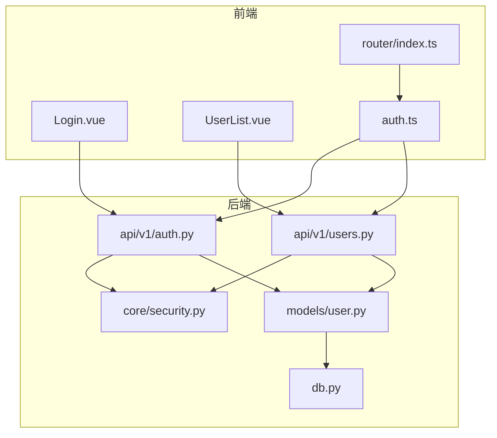
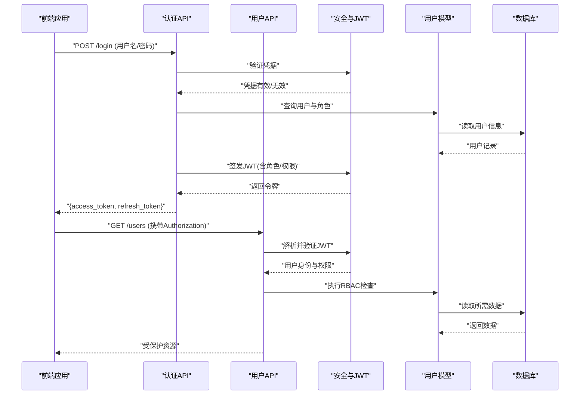
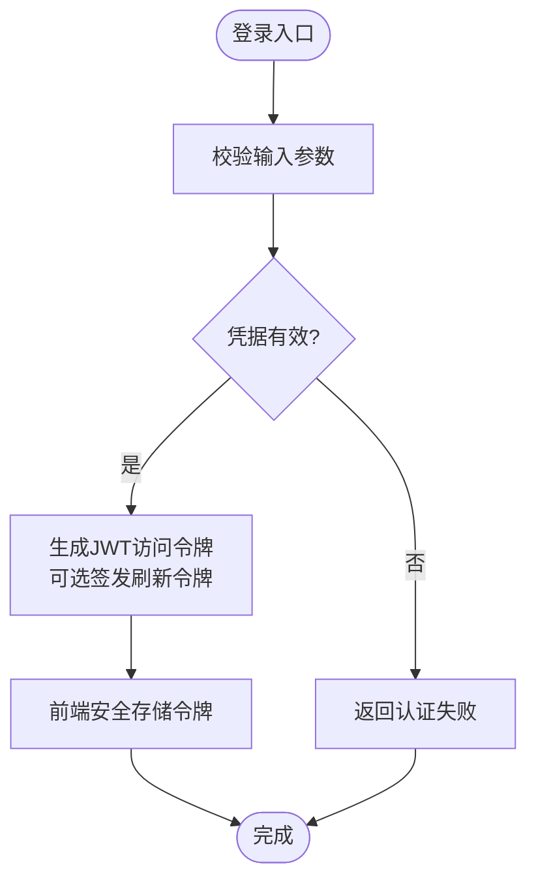
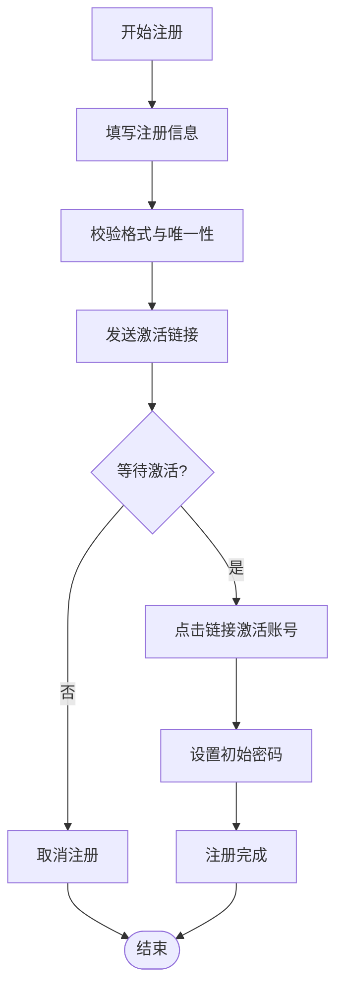
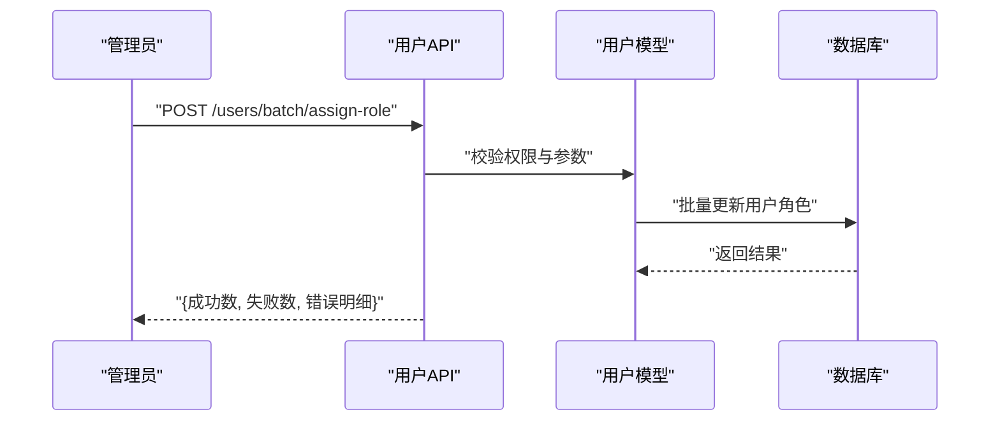
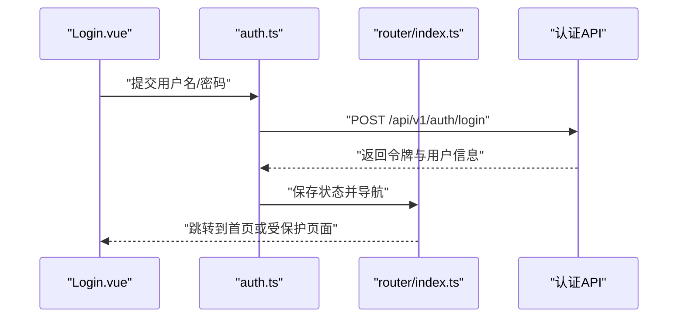
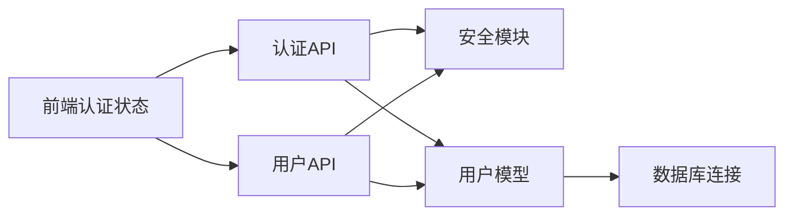

# 用户管理模块

<cite>
**本文引用的文件**   
- [backend/app/api/v1/auth.py](file://backend/app/api/v1/auth.py)
- [backend/app/api/v1/users.py](file://backend/app/api/v1/users.py)
- [backend/app/core/security.py](file://backend/app/core/security.py)
- [backend/app/models/user.py](file://backend/app/models/user.py)
- [backend/app/schemas.py](file://backend/app/schemas.py)
- [backend/app/db.py](file://backend/app/db.py)
- [frontend/src/stores/auth.ts](file://frontend/src/stores/auth.ts)
- [frontend/src/views/Login.vue](file://frontend/src/views/Login.vue)
- [frontend/src/views/UserList.vue](file://frontend/src/views/UserList.vue)
- [frontend/src/router/index.ts](file://frontend/src/router/index.ts)
</cite>

## 目录
1. [简介](#简介)
2. [项目结构](#项目结构)
3. [核心组件](#核心组件)
4. [架构总览](#架构总览)
5. [详细组件分析](#详细组件分析)
6. [依赖关系分析](#依赖关系分析)
7. [性能考虑](#性能考虑)
8. [故障排查指南](#故障排查指南)
9. [结论](#结论)
10. [附录](#附录)

## 简介
本文件面向Talos平台的用户管理模块，系统性阐述认证与授权、JWT令牌与会话控制、密码安全策略、基于角色的访问控制（RBAC）、用户生命周期管理、用户组与批量权限分配、审计日志与安全事件监控、多因素认证（MFA）与单点登录（SSO）集成、以及API接口与前端集成要点。文档兼顾技术深度与可读性，帮助后端、前端与运维人员快速理解并正确集成该模块。

## 项目结构
用户管理相关代码主要分布在后端API层、安全与模型层、数据库连接层，以及前端的认证状态管理与视图路由中：
- 后端API：认证与用户管理的REST接口定义在api/v1下
- 安全与配置：JWT、密码哈希、会话策略等集中在core/security.py
- 数据模型：用户实体与关联关系在models/user.py
- 数据库：ORM/连接在db.py
- 前端：登录流程、用户列表、鉴权守卫等在stores、views、router中



图表来源 
- [backend/app/api/v1/auth.py](file://backend/app/api/v1/auth.py)
- [backend/app/api/v1/users.py](file://backend/app/api/v1/users.py)
- [backend/app/core/security.py](file://backend/app/core/security.py)
- [backend/app/models/user.py](file://backend/app/models/user.py)
- [backend/app/db.py](file://backend/app/db.py)
- [frontend/src/stores/auth.ts](file://frontend/src/stores/auth.ts)
- [frontend/src/views/Login.vue](file://frontend/src/views/Login.vue)
- [frontend/src/views/UserList.vue](file://frontend/src/views/UserList.vue)
- [frontend/src/router/index.ts](file://frontend/src/router/index.ts)

章节来源
- [backend/app/api/v1/auth.py](file://backend/app/api/v1/auth.py)
- [backend/app/api/v1/users.py](file://backend/app/api/v1/users.py)
- [backend/app/core/security.py](file://backend/app/core/security.py)
- [backend/app/models/user.py](file://backend/app/models/user.py)
- [backend/app/db.py](file://backend/app/db.py)
- [frontend/src/stores/auth.ts](file://frontend/src/stores/auth.ts)
- [frontend/src/views/Login.vue](file://frontend/src/views/Login.vue)
- [frontend/src/views/UserList.vue](file://frontend/src/views/UserList.vue)
- [frontend/src/router/index.ts](file://frontend/src/router/index.ts)

## 核心组件
- 认证服务（Auth Service）
  - 负责登录、登出、刷新令牌、密码重置、邮箱激活等流程
  - 输出JWT访问令牌与可选刷新令牌，维护令牌黑名单或短期会话
- 用户服务（User Service）
  - 提供用户CRUD、角色与组管理、批量操作、状态变更（启用/禁用/注销）
- 安全与令牌（Security & JWT）
  - 密码哈希与校验、令牌签发与验证、过期策略、签名密钥管理
- 数据模型（User Model）
  - 用户实体、角色与组关系、审计字段（创建/更新时间）
- 数据库连接（DB）
  - ORM会话、事务、迁移与索引优化

章节来源
- [backend/app/api/v1/auth.py](file://backend/app/api/v1/auth.py)
- [backend/app/api/v1/users.py](file://backend/app/api/v1/users.py)
- [backend/app/core/security.py](file://backend/app/core/security.py)
- [backend/app/models/user.py](file://backend/app/models/user.py)
- [backend/app/db.py](file://backend/app/db.py)

## 架构总览
下图展示从前端到后端的认证与授权关键路径，包括JWT签发、请求鉴权、RBAC决策与审计记录。



图表来源 
- [backend/app/api/v1/auth.py](file://backend/app/api/v1/auth.py)
- [backend/app/api/v1/users.py](file://backend/app/api/v1/users.py)
- [backend/app/core/security.py](file://backend/app/core/security.py)
- [backend/app/models/user.py](file://backend/app/models/user.py)
- [backend/app/db.py](file://backend/app/db.py)

## 详细组件分析

### 认证与令牌管理（JWT与密码安全）
- 登录流程
  - 前端提交用户名与密码至认证接口
  - 后端校验密码哈希，生成JWT访问令牌（可包含角色与权限声明），必要时签发刷新令牌
  - 返回令牌给前端，前端存储于本地存储或内存
- 令牌验证与刷新
  - 后续请求通过Authorization头携带JWT
  - 中间件解析并验证签名、过期时间；支持短效访问令牌+长效刷新令牌的轮换
  - 刷新接口使用刷新令牌换取新访问令牌
- 密码安全策略
  - 使用强哈希算法（如bcrypt/argon2）进行密码存储
  - 强制复杂度策略（长度、字符集、历史重复限制）
  - 失败次数限制与账户锁定策略
- 会话控制
  - 无状态JWT为主，结合短期令牌与刷新机制
  - 可选服务端令牌黑名单用于强制登出与撤销



图表来源 
- [backend/app/api/v1/auth.py](file://backend/app/api/v1/auth.py)
- [backend/app/core/security.py](file://backend/app/core/security.py)

章节来源
- [backend/app/api/v1/auth.py](file://backend/app/api/v1/auth.py)
- [backend/app/core/security.py](file://backend/app/core/security.py)

### 基于角色的访问控制（RBAC）
- 角色与权限模型
  - 用户与角色多对多，角色与权限多对多
  - 权限粒度可细化到资源与动作（如“资产:查看”、“漏洞:编辑”）
- 授权决策
  - 中间件在JWT中解析角色与权限声明
  - 资源级校验：根据路由或控制器注解判断是否允许访问
- 细粒度授权
  - 支持对象级权限（例如仅允许编辑自己创建的资产）
  - 动态权限计算：结合用户角色、组与业务上下文

```mermaid
classDiagram
class 用户 {
+id : 整数
+用户名 : 字符串
+邮箱 : 字符串
+状态 : 枚举
+创建时间 : 时间戳
+更新时间 : 时间戳
}
class 角色 {
+id : 整数
+名称 : 字符串
+描述 : 字符串
}
class 权限 {
+id : 整数
+资源 : 字符串
+动作 : 字符串
}
class 用户角色 {
+用户_id : 整数
+角色_id : 整数
}
class 角色权限 {
+角色_id : 整数
+权限_id : 整数
}
用户 ||--o{ 用户角色 : "拥有"
角色 ||--o{ 用户角色 : "被赋予"
角色 ||--o{ 角色权限 : "包含"
权限 ||--o{ 角色权限 : "被包含"
```

图表来源 
- [backend/app/models/user.py](file://backend/app/models/user.py)

章节来源
- [backend/app/models/user.py](file://backend/app/models/user.py)

### 用户生命周期管理
- 注册与激活
  - 新用户注册需邮箱验证或管理员激活
  - 激活链接包含一次性令牌，防止重放攻击
- 启用/禁用与注销
  - 管理员可切换用户状态（启用/禁用）
  - 注销流程删除或归档用户数据，保留审计痕迹
- 密码重置
  - 通过邮件发送重置链接，限时有效且一次性使用



章节来源
- [backend/app/api/v1/users.py](file://backend/app/api/v1/users.py)
- [backend/app/api/v1/auth.py](file://backend/app/api/v1/auth.py)

### 用户组管理与批量权限分配
- 用户组
  - 将多个用户归入同一组，便于统一权限管理
  - 组继承角色权限，简化大规模权限配置
- 批量操作
  - 支持批量添加/移除角色、批量启用/禁用、批量导入导出
  - 提供幂等接口与事务保证，避免部分成功导致的不一致



图表来源 
- [backend/app/api/v1/users.py](file://backend/app/api/v1/users.py)
- [backend/app/models/user.py](file://backend/app/models/user.py)

章节来源
- [backend/app/api/v1/users.py](file://backend/app/api/v1/users.py)

### 审计日志与安全事件监控
- 审计日志
  - 记录关键操作：登录/登出、权限变更、用户状态变更、批量操作
  - 包含操作者、时间、IP、目标对象与结果
- 安全事件
  - 异常登录检测（频繁失败、异地登录）
  - 敏感操作告警（提权、批量禁用）
- 存储与查询
  - 独立审计表或外部日志系统（如ELK）
  - 提供只读API供审计与合规审查

章节来源
- [backend/app/api/v1/users.py](file://backend/app/api/v1/users.py)
- [backend/app/api/v1/auth.py](file://backend/app/api/v1/auth.py)

### 多因素认证（MFA）与单点登录（SSO）
- MFA
  - 支持TOTP（基于时间的一次性密码）或短信/邮箱验证码
  - 登录流程增加第二因子校验，提升安全性
- SSO
  - 集成OAuth2/OIDC或SAML，支持企业身份提供商
  - 统一身份源，减少密码管理成本

章节来源
- [backend/app/api/v1/auth.py](file://backend/app/api/v1/auth.py)

### API接口文档（摘要）
以下为常用接口说明（方法、路径、用途、鉴权要求）：
- 认证
  - POST /api/v1/auth/login：用户登录，返回访问令牌与刷新令牌
  - POST /api/v1/auth/refresh：刷新访问令牌
  - POST /api/v1/auth/logout：登出（可选：加入令牌黑名单）
  - POST /api/v1/auth/password-reset：发起密码重置
- 用户管理
  - GET /api/v1/users：分页查询用户列表（需管理员角色）
  - GET /api/v1/users/{id}：获取用户详情
  - POST /api/v1/users：注册用户（需邮箱激活）
  - PUT /api/v1/users/{id}：更新用户信息
  - DELETE /api/v1/users/{id}：注销或删除用户
  - POST /api/v1/users/batch/assign-role：批量分配角色
  - PATCH /api/v1/users/{id}/status：启用/禁用用户
- 审计与监控
  - GET /api/v1/audit/logs：查询审计日志（管理员）
  - GET /api/v1/security/events：安全事件列表（管理员）

注意：所有受保护接口需在请求头携带Authorization: Bearer <token>。

章节来源
- [backend/app/api/v1/auth.py](file://backend/app/api/v1/auth.py)
- [backend/app/api/v1/users.py](file://backend/app/api/v1/users.py)

### 前端组件集成指南
- 登录页面
  - 调用认证接口获取令牌
  - 将令牌存入本地存储（建议HttpOnly Cookie或内存存储）
  - 跳转至首页或受保护页面
- 认证状态管理
  - 集中管理令牌、用户信息与权限
  - 拦截器自动附加Authorization头
  - 处理401/403响应，触发重新登录或提示无权限
- 路由守卫
  - 未登录重定向至登录页
  - 按角色控制页面访问
- 用户列表与操作
  - 调用用户管理API实现增删改查与批量操作
  - 显示权限与角色信息，支持管理员操作



图表来源 
- [frontend/src/views/Login.vue](file://frontend/src/views/Login.vue)
- [frontend/src/stores/auth.ts](file://frontend/src/stores/auth.ts)
- [frontend/src/router/index.ts](file://frontend/src/router/index.ts)
- [backend/app/api/v1/auth.py](file://backend/app/api/v1/auth.py)

章节来源
- [frontend/src/views/Login.vue](file://frontend/src/views/Login.vue)
- [frontend/src/stores/auth.ts](file://frontend/src/stores/auth.ts)
- [frontend/src/router/index.ts](file://frontend/src/router/index.ts)
- [frontend/src/views/UserList.vue](file://frontend/src/views/UserList.vue)

## 依赖关系分析
- 模块耦合
  - 认证API依赖安全模块与用户模型
  - 用户API依赖安全模块、用户模型与数据库连接
  - 前端依赖认证状态管理与路由守卫
- 外部依赖
  - JWT库、密码哈希库、ORM框架、HTTP客户端
- 潜在循环依赖
  - 确保API层不直接依赖UI层，模型层不依赖API层



图表来源 
- [backend/app/api/v1/auth.py](file://backend/app/api/v1/auth.py)
- [backend/app/api/v1/users.py](file://backend/app/api/v1/users.py)
- [backend/app/core/security.py](file://backend/app/core/security.py)
- [backend/app/models/user.py](file://backend/app/models/user.py)
- [backend/app/db.py](file://backend/app/db.py)
- [frontend/src/stores/auth.ts](file://frontend/src/stores/auth.ts)

章节来源
- [backend/app/api/v1/auth.py](file://backend/app/api/v1/auth.py)
- [backend/app/api/v1/users.py](file://backend/app/api/v1/users.py)
- [backend/app/core/security.py](file://backend/app/core/security.py)
- [backend/app/models/user.py](file://backend/app/models/user.py)
- [backend/app/db.py](file://backend/app/db.py)
- [frontend/src/stores/auth.ts](file://frontend/src/stores/auth.ts)

## 性能考虑
- 令牌策略
  - 短效访问令牌降低泄露风险，配合刷新令牌提升用户体验
  - 避免在服务端存储大量会话状态
- 数据库优化
  - 为常用查询建立索引（用户名、邮箱、角色、组）
  - 批量操作使用事务与分批写入，减少锁竞争
- 缓存与限流
  - 对热点数据（如角色权限映射）进行缓存
  - 登录与密码重置接口实施速率限制，防止暴力破解

[本节为通用指导，无需特定文件来源]

## 故障排查指南
- 常见问题
  - 登录失败：检查用户名/密码、账户状态、失败次数限制
  - 令牌过期：确认刷新流程与存储位置
  - 权限不足：核对角色与权限分配、RBAC规则
  - 批量操作失败：查看错误明细与事务回滚情况
- 调试建议
  - 开启详细日志，记录认证与授权决策过程
  - 使用测试账号模拟不同角色与场景
  - 检查网络请求与响应头（Authorization、Set-Cookie）

章节来源
- [backend/app/api/v1/auth.py](file://backend/app/api/v1/auth.py)
- [backend/app/api/v1/users.py](file://backend/app/api/v1/users.py)
- [backend/app/core/security.py](file://backend/app/core/security.py)

## 结论
Talos平台的用户管理模块以JWT为核心，结合RBAC与用户组管理，提供了完整的认证、授权与生命周期管理能力。通过清晰的API设计与前端集成方案，开发者可以快速构建安全的用户系统。建议在生产环境启用MFA与SSO，完善审计与监控，持续优化性能与安全性。

[本节为总结，无需特定文件来源]

## 附录
- 术语表
  - JWT：JSON Web Token，用于无状态身份验证
  - RBAC：基于角色的访问控制
  - MFA：多因素认证
  - SSO：单点登录
- 最佳实践
  - 最小权限原则：为用户分配最小必要权限
  - 定期审计：审查用户角色与权限分配
  - 安全配置：强密码策略、令牌过期、速率限制

[本节为补充信息，无需特定文件来源]