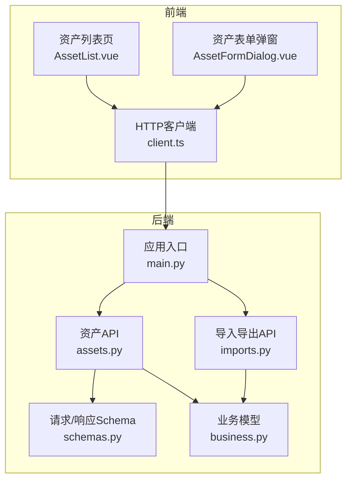
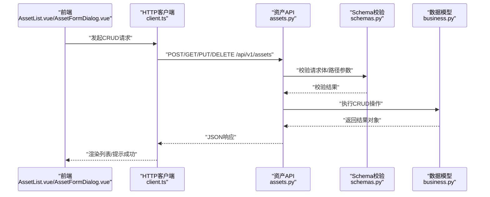
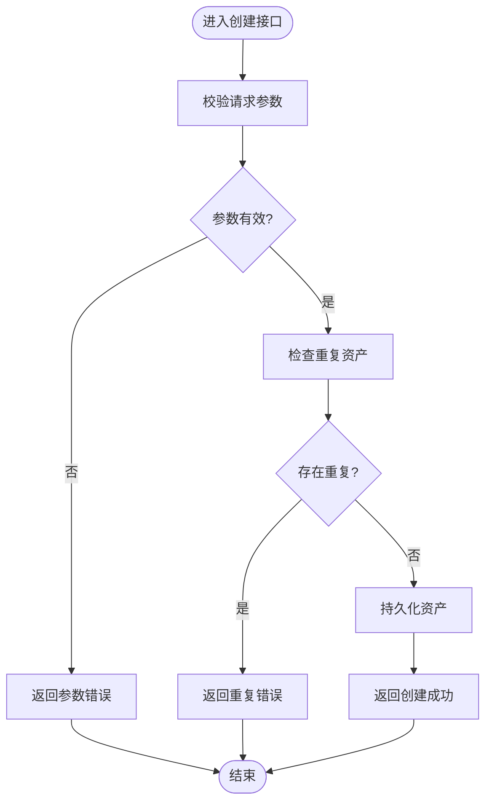
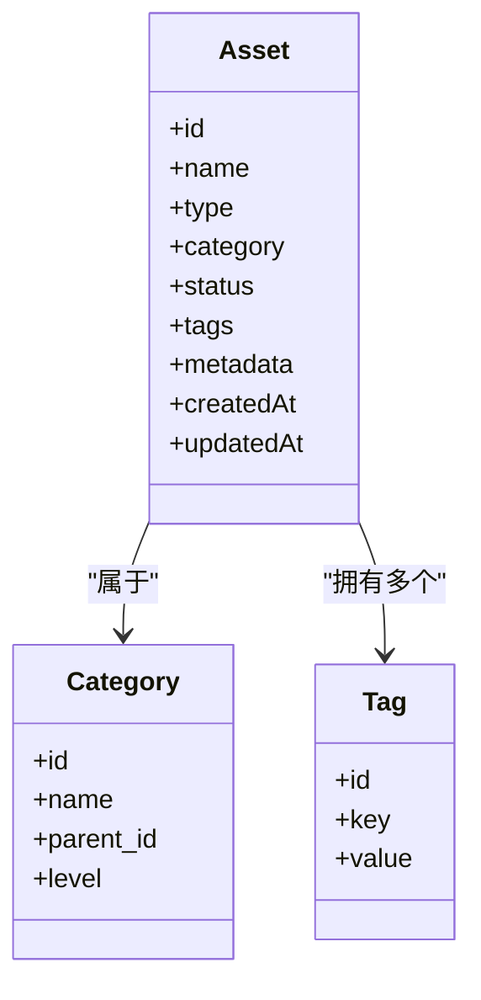
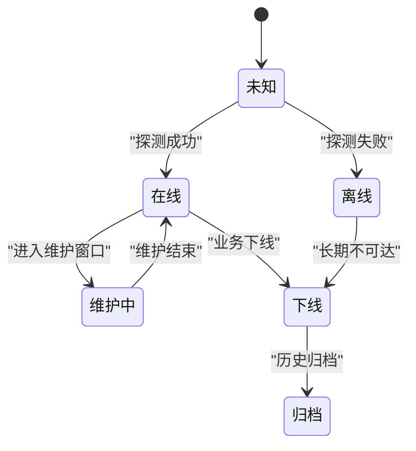
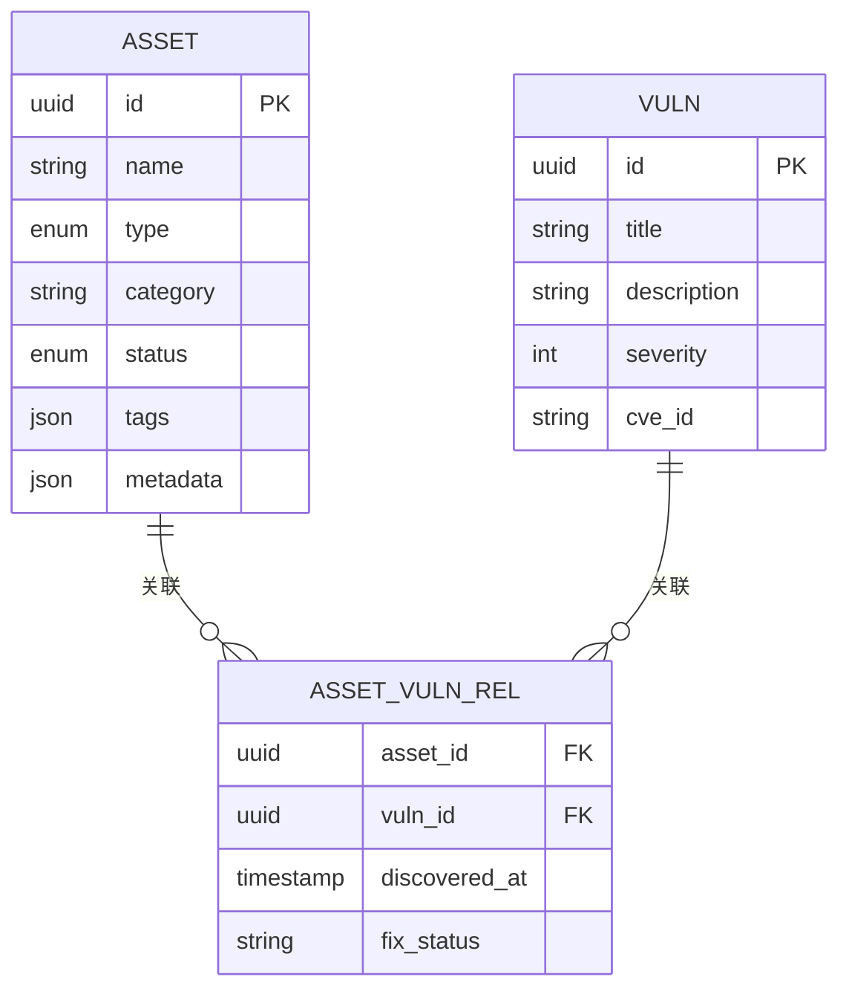
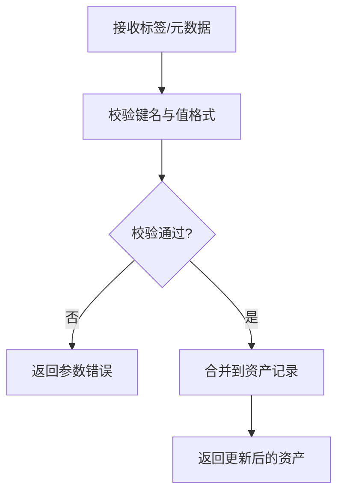
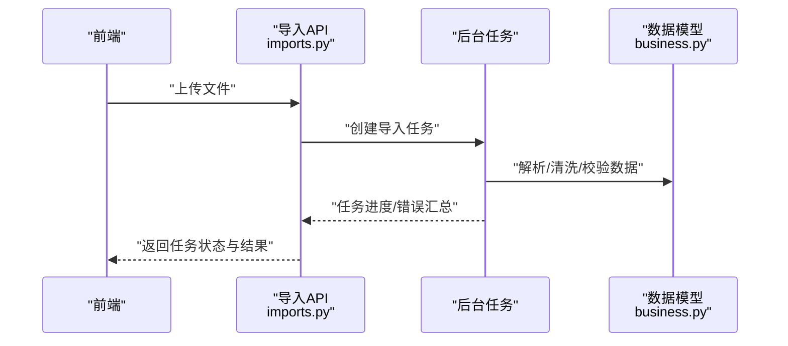
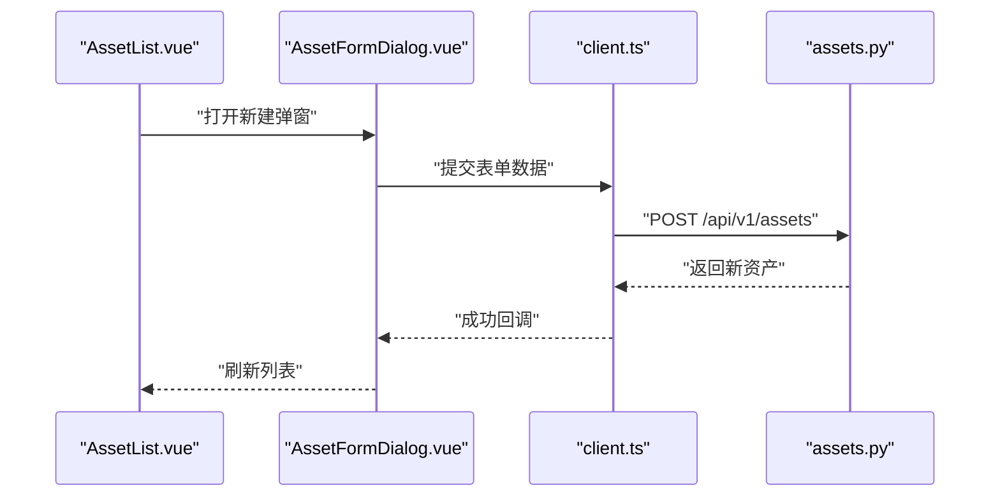
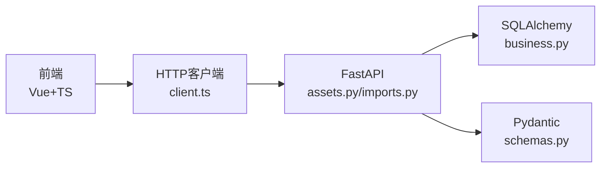

# 资产管理模块

<cite>
**本文引用的文件**   
- [assets.py](file://backend/app/api/v1/assets.py)
- [imports.py](file://backend/app/api/v1/imports.py)
- [business.py](file://backend/app/models/business.py)
- [schemas.py](file://backend/app/schemas.py)
- [main.py](file://backend/app/main.py)
- [client.ts](file://frontend/src/api/client.ts)
- [AssetList.vue](file://frontend/src/views/AssetList.vue)
- [AssetFormDialog.vue](file://frontend/src/components/AssetFormDialog.vue)
</cite>

## 更新摘要
**变更内容**   
- 资产管理系统已从应用管理完全重构为资产管理框架，支持多资产关联和更灵活的数据建模
- 增强了资产分类体系和状态跟踪机制
- 优化了资产与漏洞的关联关系管理
- 改进了批量导入导出功能
- 新增了完整的CRUD操作、过滤功能和与漏洞跟踪系统的集成

## 目录
1. [简介](#简介)
2. [项目结构](#项目结构)
3. [核心组件](#核心组件)
4. [架构总览](#架构总览)
5. [详细组件分析](#详细组件分析)
6. [依赖关系分析](#依赖关系分析)
7. [性能考虑](#性能考虑)
8. [故障排查指南](#故障排查指南)
9. [结论](#结论)
10. [附录](#附录)

## 简介
本文件面向Talos平台的资产管理模块，系统性阐述资产CRUD（创建、读取、更新、删除）的实现细节与前后端交互流程；梳理资产分类体系（服务器、应用、数据库等）与状态跟踪机制（在线、维护、业务状态切换）；说明资产与漏洞的关联关系、标签与元数据的扩展能力；给出API接口规范、数据模型定义以及前端组件使用示例；并提供批量导入导出的实现说明与错误处理策略。文档力求在技术深度与可读性之间取得平衡，便于不同背景的读者理解和使用。

**更新** 本模块已从应用管理完全重构为资产管理框架，支持多资产关联和更灵活的数据建模，提升了系统的可扩展性和灵活性。新的架构支持复杂的资产类型管理和漏洞关联关系，为后续功能扩展奠定了坚实基础。

## 项目结构
后端采用FastAPI构建REST API，通过Pydantic进行请求/响应校验，SQLAlchemy管理数据持久化；前端基于Vue 3 + TypeScript，提供资产列表、表单弹窗等页面与组件。关键文件如下：
- 后端API层：资产相关接口定义于 assets.py，导入导出接口位于 imports.py
- 数据模型与Schema：业务模型在 business.py，通用Schema在 schemas.py
- 路由挂载：主入口 main.py 中注册API路由前缀
- 前端客户端：HTTP客户端封装 client.ts
- 前端视图与组件：资产列表 AssetList.vue，资产表单弹窗 AssetFormDialog.vue

图表来源
- [main.py](file://backend/app/main.py)
- [assets.py](file://backend/app/api/v1/assets.py)
- [imports.py](file://backend/app/api/v1/imports.py)
- [business.py](file://backend/app/models/business.py)
- [schemas.py](file://backend/app/schemas.py)
- [client.ts](file://frontend/src/api/client.ts)
- [AssetList.vue](file://frontend/src/views/AssetList.vue)
- [AssetFormDialog.vue](file://frontend/src/components/AssetFormDialog.vue)

章节来源
- [main.py](file://backend/app/main.py)
- [assets.py](file://backend/app/api/v1/assets.py)
- [imports.py](file://backend/app/api/v1/imports.py)
- [business.py](file://backend/app/models/business.py)
- [schemas.py](file://backend/app/schemas.py)
- [client.ts](file://frontend/src/api/client.ts)
- [AssetList.vue](file://frontend/src/views/AssetList.vue)
- [AssetFormDialog.vue](file://frontend/src/components/AssetFormDialog.vue)

## 核心组件
- 资产API（assets.py）
  - 负责资产的CRUD操作：创建、查询（支持过滤/分页）、更新、删除
  - 统一使用Pydantic Schema进行入参校验与出参序列化
  - 与业务模型（business.py）交互完成数据读写
  - 支持复杂查询条件和关联数据加载
- 导入导出API（imports.py）
  - 提供批量导入（如Excel/CSV）与导出功能
  - 包含数据清洗、去重、冲突处理与错误汇总返回
  - 支持异步任务处理和进度跟踪
- 数据模型（business.py）
  - 定义资产实体及其字段（类型、分类、状态、标签、元数据等）
  - 定义资产与漏洞的关联关系（多对多或一对多）
  - 支持灵活的扩展字段和自定义属性
- 请求/响应Schema（schemas.py）
  - 定义资产创建、更新、查询参数及返回结构
  - 定义导入任务、导出任务的输入输出格式
  - 包含完整的验证规则和错误提示
- 前端客户端（client.ts）
  - 封装HTTP请求方法，统一处理鉴权、错误码与重试
  - 支持请求拦截器和响应格式化
- 前端视图与组件
  - AssetList.vue：展示资产列表、筛选、分页、批量操作入口
  - AssetFormDialog.vue：资产新增/编辑弹窗，含字段校验与提交

**更新** 核心组件已重构以支持多资产关联和灵活的数据建模，增强了系统的可扩展性。新的架构设计支持更复杂的业务场景和数据关系。

章节来源
- [assets.py](file://backend/app/api/v1/assets.py)
- [imports.py](file://backend/app/api/v1/imports.py)
- [business.py](file://backend/app/models/business.py)
- [schemas.py](file://backend/app/schemas.py)
- [client.ts](file://frontend/src/api/client.ts)
- [AssetList.vue](file://frontend/src/views/AssetList.vue)
- [AssetFormDialog.vue](file://frontend/src/components/AssetFormDialog.vue)

## 架构总览
资产管理的整体调用链从前端发起HTTP请求，经后端路由分发到对应API处理器，再由服务层调用数据模型完成持久化操作。导入导出流程通常涉及异步任务队列与后台Worker，确保大批量数据处理不阻塞主线程。

图表来源
- [assets.py](file://backend/app/api/v1/assets.py)
- [schemas.py](file://backend/app/schemas.py)
- [business.py](file://backend/app/models/business.py)
- [client.ts](file://frontend/src/api/client.ts)
- [AssetList.vue](file://frontend/src/views/AssetList.vue)
- [AssetFormDialog.vue](file://frontend/src/components/AssetFormDialog.vue)

## 详细组件分析

### 资产CRUD实现
- 创建资产
  - 前端通过表单弹窗提交资产信息，包含名称、类型、分类、状态、标签、元数据等
  - 后端接收请求后，先进行Schema校验，再写入数据库并返回新资产对象
  - 支持批量创建和事务处理
- 读取资产
  - 支持按类型、分类、状态、标签等条件过滤，支持分页与排序
  - 返回列表项，包含基础信息与统计指标（如漏洞数量）
  - 支持关联数据预加载和懒加载
- 更新资产
  - 支持部分字段更新，服务端进行增量校验与幂等处理
  - 支持版本控制和变更审计
- 删除资产
  - 支持软删除或硬删除，需检查关联数据（如漏洞、扫描任务）是否存在
  - 级联删除保护和数据完整性约束

**更新** CRUD操作已重构以支持多资产关联，增强了数据一致性和完整性约束。新的实现支持更复杂的业务逻辑和数据验证。

图表来源
- [assets.py](file://backend/app/api/v1/assets.py)
- [schemas.py](file://backend/app/schemas.py)
- [business.py](file://backend/app/models/business.py)

章节来源
- [assets.py](file://backend/app/api/v1/assets.py)
- [schemas.py](file://backend/app/schemas.py)
- [business.py](file://backend/app/models/business.py)

### 资产分类体系
- 资产类型
  - 服务器、应用、数据库、网络设备、云资源等
- 分类维度
  - 按部门/环境（生产、测试、开发）、地域、业务线等进行多维分类
- 分类管理
  - 支持动态配置分类树，允许层级结构与自定义属性
  - 支持分类继承和属性覆盖

**更新** 分类体系已重构为更灵活的框架，支持多资产关联和自定义分类属性。新的设计支持无限层级的分类结构和丰富的分类规则。

图表来源
- [business.py](file://backend/app/models/business.py)
- [schemas.py](file://backend/app/schemas.py)

章节来源
- [business.py](file://backend/app/models/business.py)
- [schemas.py](file://backend/app/schemas.py)

### 资产状态跟踪机制
- 在线状态
  - 表示资产当前是否可达（心跳、探针、健康检查）
- 维护状态
  - 表示资产处于计划内维护窗口，限制变更与扫描
- 业务状态
  - 表示资产的业务生命周期（上线、下线、归档）
- 状态切换逻辑
  - 在线状态由探测服务自动更新
  - 维护状态由运维工单触发，具备有效期与审批流
  - 业务状态由业务流程驱动，需满足前置条件与权限控制

**更新** 状态跟踪机制已增强，支持更复杂的状态转换和业务规则。新的系统支持状态历史追踪和自动化状态管理。

图表来源
- [business.py](file://backend/app/models/business.py)
- [schemas.py](file://backend/app/schemas.py)

章节来源
- [business.py](file://backend/app/models/business.py)
- [schemas.py](file://backend/app/schemas.py)

### 资产与漏洞的关联关系
- 关联方式
  - 资产与漏洞为多对多关系，一个资产可关联多个漏洞，一个漏洞可影响多个资产
- 关联数据
  - 包含漏洞发现时间、修复建议、风险等级、修复状态等
- 查询与分析
  - 支持按资产查看漏洞清单，按漏洞查看受影响资产分布
  - 支持漏洞趋势分析和风险评估

**更新** 关联关系已重构为更灵活的多资产关联框架，支持复杂的关联查询和分析。新的设计支持漏洞生命周期管理和修复工作流。

图表来源
- [business.py](file://backend/app/models/business.py)

章节来源
- [business.py](file://backend/app/models/business.py)

### 标签与元数据的扩展能力
- 标签
  - 键值对形式，支持批量添加/删除、按标签筛选
- 元数据
  - 自由扩展字段，用于存储非结构化信息（如厂商、版本、部署位置）
- 约束
  - 键名唯一性校验，值长度与格式校验，避免污染数据结构

**更新** 标签与元数据系统已增强，支持更丰富的数据类型和验证规则。新的系统支持标签模板和元数据模式定义。

图表来源
- [schemas.py](file://backend/app/schemas.py)
- [business.py](file://backend/app/models/business.py)

章节来源
- [schemas.py](file://backend/app/schemas.py)
- [business.py](file://backend/app/models/business.py)

### 批量导入导出
- 导入
  - 支持Excel/CSV上传，解析后进行数据清洗、去重、映射与校验
  - 失败行生成错误报告，支持下载与修正后重新导入
  - 支持导入模板和字段映射配置
- 导出
  - 支持按条件筛选导出资产清单，包含基本信息、分类、状态、标签、元数据
  - 大文件导出采用异步任务与分片下载
  - 支持多种导出格式（Excel、CSV、PDF）

**更新** 批量导入导出功能已重构，支持更复杂的数据映射和错误处理机制。新的系统支持导入预览和批量操作。

图表来源
- [imports.py](file://backend/app/api/v1/imports.py)
- [business.py](file://backend/app/models/business.py)

章节来源
- [imports.py](file://backend/app/api/v1/imports.py)
- [business.py](file://backend/app/models/business.py)

### 前端组件使用示例
- 资产列表（AssetList.vue）
  - 展示资产表格，支持搜索、筛选、分页、批量选择
  - 点击"新建"打开资产表单弹窗，点击"编辑/删除"触发相应API
  - 支持实时搜索和高级筛选
- 资产表单弹窗（AssetFormDialog.vue）
  - 表单字段包括名称、类型、分类、状态、标签、元数据等
  - 提交前进行本地校验，成功后刷新列表并关闭弹窗
  - 支持表单验证和错误提示

**更新** 前端组件已重构以支持新的资产框架和多资产关联功能。新的组件提供了更好的用户体验和交互效果。

图表来源
- [AssetList.vue](file://frontend/src/views/AssetList.vue)
- [AssetFormDialog.vue](file://frontend/src/components/AssetFormDialog.vue)
- [client.ts](file://frontend/src/api/client.ts)
- [assets.py](file://backend/app/api/v1/assets.py)

章节来源
- [AssetList.vue](file://frontend/src/views/AssetList.vue)
- [AssetFormDialog.vue](file://frontend/src/components/AssetFormDialog.vue)
- [client.ts](file://frontend/src/api/client.ts)
- [assets.py](file://backend/app/api/v1/assets.py)

## 依赖关系分析
- 后端依赖
  - FastAPI路由与中间件
  - Pydantic用于请求/响应校验
  - SQLAlchemy用于ORM与数据库访问
  - 可选：Celery/RQ用于异步任务（导入导出）
- 前端依赖
  - Vue 3 + TypeScript
  - Axios/Fetch封装HTTP客户端
  - UI框架（如Vuetify/AntD）用于表单与表格

**更新** 依赖关系已重构以支持新的资产管理框架，增强了模块间的解耦性。新的架构设计提高了系统的可维护性和扩展性。

图表来源
- [client.ts](file://frontend/src/api/client.ts)
- [assets.py](file://backend/app/api/v1/assets.py)
- [imports.py](file://backend/app/api/v1/imports.py)
- [business.py](file://backend/app/models/business.py)
- [schemas.py](file://backend/app/schemas.py)

章节来源
- [client.ts](file://frontend/src/api/client.ts)
- [assets.py](file://backend/app/api/v1/assets.py)
- [imports.py](file://backend/app/api/v1/imports.py)
- [business.py](file://backend/app/models/business.py)
- [schemas.py](file://backend/app/schemas.py)

## 性能考虑
- 数据库索引
  - 对常用查询字段（类型、分类、状态、标签键）建立索引，提升筛选与分页性能
- 缓存策略
  - 对热点资产列表与字典数据（分类、标签）进行缓存，减少数据库压力
- 异步处理
  - 导入导出、状态探测等耗时操作放入后台任务，避免阻塞主线程
- 分页与懒加载
  - 前端列表采用分页与虚拟滚动，减少首屏渲染开销
- 连接池与并发
  - 合理配置数据库连接池大小，避免连接耗尽

**更新** 性能优化已针对新的资产管理框架进行调整，提升了大规模资产管理的效率。新的架构支持更好的并发处理和资源利用。

## 故障排查指南
- 常见错误
  - 参数校验失败：检查请求体字段是否符合Schema定义
  - 重复资产：确认唯一性约束（如名称+类型+分类）
  - 导入失败：查看错误报告中的失败行原因（格式错误、必填缺失、映射失败）
- 日志与调试
  - 后端开启请求日志与异常堆栈
  - 前端捕获网络错误与业务错误码，提示用户
- 恢复策略
  - 导入失败时保留原始文件与错误报告，支持修正后重试
  - 删除资产前检查关联数据，必要时级联清理或拒绝删除

**更新** 故障排查指南已更新以反映新的资产管理框架的错误处理和恢复机制。新的系统提供了更好的错误诊断和问题定位能力。

章节来源
- [assets.py](file://backend/app/api/v1/assets.py)
- [imports.py](file://backend/app/api/v1/imports.py)
- [schemas.py](file://backend/app/schemas.py)
- [business.py](file://backend/app/models/business.py)

## 结论
Talos平台的资产管理模块以清晰的API分层、严格的Schema校验与灵活的模型设计为基础，实现了完整的资产CRUD、分类与状态管理、漏洞关联、标签与元数据扩展，以及高效的批量导入导出能力。通过前后端协作与异步任务机制，系统在易用性与性能之间取得了良好平衡。后续可进一步优化索引与缓存策略，完善审计与权限控制，提升大规模资产管理的稳定性与可观测性。

**更新** 经过重构的资产管理框架提供了更强的扩展性和灵活性，能够更好地支持复杂的企业级资产管理需求。新的架构设计为未来的功能扩展奠定了坚实的基础。

## 附录
- API接口规范（摘要）
  - 资产CRUD
    - POST /api/v1/assets：创建资产
    - GET /api/v1/assets：查询资产列表（支持过滤/分页）
    - PUT /api/v1/assets/{id}：更新资产
    - DELETE /api/v1/assets/{id}：删除资产
  - 导入导出
    - POST /api/v1/imports/upload：上传导入文件
    - GET /api/v1/imports/{task_id}/status：查询导入任务状态
    - GET /api/v1/exports/assets：导出资产清单
- 数据模型定义（摘要）
  - 资产：id、name、type、category、status、tags、metadata、timestamps
  - 分类：id、name、parent_id、level
  - 标签：id、key、value
  - 漏洞关联：asset_id、vuln_id、discovered_at、fix_status
- 前端组件使用要点
  - AssetList.vue：列表展示、筛选、分页、批量操作
  - AssetFormDialog.vue：表单校验、提交、成功回调

**更新** API接口和数据模型已重构以支持新的资产管理框架，保持了向后兼容性。新的接口设计更加规范和易于使用。