# 项目概览

<cite>
**本文引用的文件**   
- [backend/app/main.py](file://backend/app/main.py)
- [backend/app/api/v1/assets.py](file://backend/app/api/v1/assets.py)
- [backend/app/api/v1/auth.py](file://backend/app/api/v1/auth.py)
- [backend/app/api/v1/reports.py](file://backend/app/api/v1/reports.py)
- [backend/app/api/v1/users.py](file://backend/app/api/v1/users.py)
- [backend/app/core/config.py](file://backend/app/core/config.py)
- [backend/app/core/security.py](file://backend/app/core/security.py)
- [backend/app/db.py](file://backend/app/db.py)
- [backend/app/schemas.py](file://backend/app/schemas.py)
- [backend/app/services/report_builder.py](file://backend/app/services/report_builder.py)
- [backend/app/workers/main.py](file://backend/app/workers/main.py)
- [frontend/src/router/index.ts](file://frontend/src/router/index.ts)
- [frontend/src/stores/auth.ts](file://frontend/src/stores/auth.ts)
- [frontend/src/views/Dashboard.vue](file://frontend/src/views/Dashboard.vue)
- [frontend/src/views/AssetList.vue](file://frontend/src/views/AssetList.vue)
- [frontend/src/views/VulnList.vue](file://frontend/src/views/VulnList.vue)
- [frontend/src/views/ReportList.vue](file://frontend/src/views/ReportList.vue)
- [frontend/src/views/UserList.vue](file://frontend/src/views/UserList.vue)
- [frontend/src/api/client.ts](file://frontend/src/api/client.ts)
- [docker-compose.yml](file://docker-compose.yml)
- [backend/Dockerfile](file://backend/Dockerfile)
- [frontend/Dockerfile](file://frontend/Dockerfile)
</cite>

## 目录
1. [简介](#简介)
2. [项目结构](#项目结构)
3. [核心组件](#核心组件)
4. [架构总览](#架构总览)
5. [详细组件分析](#详细组件分析)
6. [依赖关系分析](#依赖关系分析)
7. [性能考量](#性能考量)
8. [故障排查指南](#故障排查指南)
9. [结论](#结论)
10. [附录：快速开始](#附录快速开始)

## 简介
Talos 漏洞管理平台是一个前后端分离的企业级安全资产管理与漏洞治理系统。后端基于 FastAPI，提供高并发、类型安全的 REST API；前端采用 Vue3 + TypeScript，构建现代化、可维护的用户界面。系统通过 Docker 容器化部署，支持一键编排启动，涵盖资产管理、漏洞管理、报告生成、用户管理等核心能力，并内置异步任务处理以支撑耗时操作（如报告导出）。

本概览文档面向开发者与运维人员，帮助快速理解整体设计、模块职责、数据流向与部署方式，并提供“快速开始”指引以便本地或生产环境快速上手。

## 项目结构
仓库采用典型的前后端分离结构：
- backend：FastAPI 应用、数据库模型、API 路由、服务层、异步 Worker、Alembic 迁移等
- frontend：Vue3 + TypeScript + Vite 前端工程，包含路由、视图、状态管理与 API 客户端
- docker-compose.yml：统一编排后端、前端、数据库等容器
- docs：版本发布与路线图说明

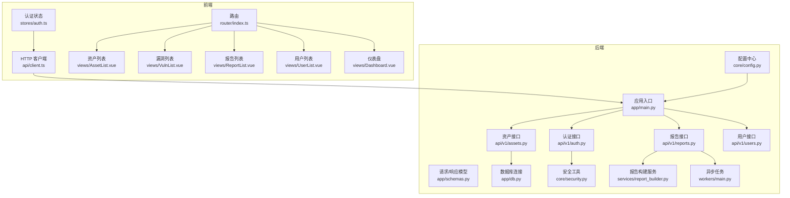

图表来源
- [backend/app/main.py](file://backend/app/main.py)
- [backend/app/api/v1/auth.py](file://backend/app/api/v1/auth.py)
- [backend/app/api/v1/assets.py](file://backend/app/api/v1/assets.py)
- [backend/app/api/v1/reports.py](file://backend/app/api/v1/reports.py)
- [backend/app/api/v1/users.py](file://backend/app/api/v1/users.py)
- [backend/app/schemas.py](file://backend/app/schemas.py)
- [backend/app/db.py](file://backend/app/db.py)
- [backend/app/core/config.py](file://backend/app/core/config.py)
- [backend/app/core/security.py](file://backend/app/core/security.py)
- [backend/app/services/report_builder.py](file://backend/app/services/report_builder.py)
- [backend/app/workers/main.py](file://backend/app/workers/main.py)
- [frontend/src/router/index.ts](file://frontend/src/router/index.ts)
- [frontend/src/stores/auth.ts](file://frontend/src/stores/auth.ts)
- [frontend/src/api/client.ts](file://frontend/src/api/client.ts)
- [frontend/src/views/AssetList.vue](file://frontend/src/views/AssetList.vue)
- [frontend/src/views/VulnList.vue](file://frontend/src/views/VulnList.vue)
- [frontend/src/views/ReportList.vue](file://frontend/src/views/ReportList.vue)
- [frontend/src/views/UserList.vue](file://frontend/src/views/UserList.vue)
- [frontend/src/views/Dashboard.vue](file://frontend/src/views/Dashboard.vue)

章节来源
- [backend/app/main.py](file://backend/app/main.py)
- [frontend/src/router/index.ts](file://frontend/src/router/index.ts)
- [docker-compose.yml](file://docker-compose.yml)

## 核心组件
- 后端应用入口与路由挂载：FastAPI 应用初始化、中间件注册、API v1 路由聚合
- 认证与安全：JWT 令牌签发与校验、密码哈希、权限控制
- 资源管理：资产 CRUD、导入预览、批量操作
- 漏洞管理：漏洞条目编辑、详情查看、列表筛选
- 报告生成：模板渲染、文档导出、异步任务队列
- 用户管理：用户增删改查、角色与权限
- 数据模型与迁移：SQLAlchemy 模型定义、Alembic 迁移脚本
- 配置与环境：环境变量加载、敏感信息保护
- 前端路由与页面：Vue Router 路由表、页面组件组织
- 前端状态与 API 客户端：认证状态持久化、统一 HTTP 封装
- 容器化与编排：Dockerfile、Nginx 静态资源服务、Compose 编排

章节来源
- [backend/app/main.py](file://backend/app/main.py)
- [backend/app/api/v1/auth.py](file://backend/app/api/v1/auth.py)
- [backend/app/api/v1/assets.py](file://backend/app/api/v1/assets.py)
- [backend/app/api/v1/reports.py](file://backend/app/api/v1/reports.py)
- [backend/app/api/v1/users.py](file://backend/app/api/v1/users.py)
- [backend/app/core/security.py](file://backend/app/core/security.py)
- [backend/app/core/config.py](file://backend/app/core/config.py)
- [backend/app/schemas.py](file://backend/app/schemas.py)
- [backend/app/db.py](file://backend/app/db.py)
- [backend/app/services/report_builder.py](file://backend/app/services/report_builder.py)
- [backend/app/workers/main.py](file://backend/app/workers/main.py)
- [frontend/src/router/index.ts](file://frontend/src/router/index.ts)
- [frontend/src/stores/auth.ts](file://frontend/src/stores/auth.ts)
- [frontend/src/api/client.ts](file://frontend/src/api/client.ts)
- [frontend/src/views/AssetList.vue](file://frontend/src/views/AssetList.vue)
- [frontend/src/views/VulnList.vue](file://frontend/src/views/VulnList.vue)
- [frontend/src/views/ReportList.vue](file://frontend/src/views/ReportList.vue)
- [frontend/src/views/UserList.vue](file://frontend/src/views/UserList.vue)
- [frontend/src/views/Dashboard.vue](file://frontend/src/views/Dashboard.vue)

## 架构总览
系统采用前后端分离与容器化部署：
- 前端通过 Nginx 提供静态资源与反向代理，调用后端 FastAPI 提供的 REST API
- 后端使用 SQLAlchemy 访问数据库，Alembic 管理迁移
- 报告生成等耗时任务通过异步 Worker 执行，避免阻塞请求
- 所有服务通过 docker-compose 统一编排，支持一键启停

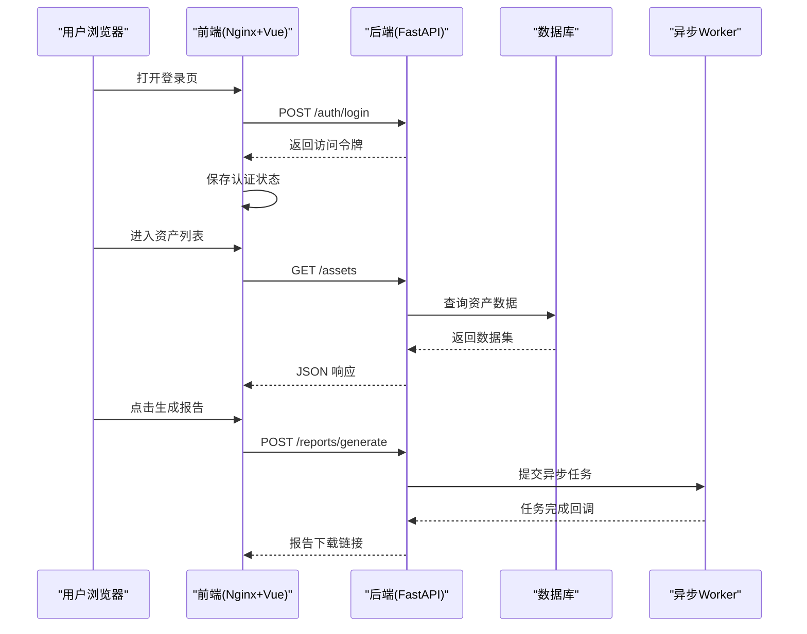

图表来源
- [backend/app/main.py](file://backend/app/main.py)
- [backend/app/api/v1/auth.py](file://backend/app/api/v1/auth.py)
- [backend/app/api/v1/assets.py](file://backend/app/api/v1/assets.py)
- [backend/app/api/v1/reports.py](file://backend/app/api/v1/reports.py)
- [backend/app/db.py](file://backend/app/db.py)
- [backend/app/workers/main.py](file://backend/app/workers/main.py)
- [frontend/src/api/client.ts](file://frontend/src/api/client.ts)
- [frontend/src/stores/auth.ts](file://frontend/src/stores/auth.ts)

## 详细组件分析

### 后端应用与路由
- 应用入口负责初始化 FastAPI 实例、注册中间件、挂载 v1 路由组
- 路由按功能域拆分：认证、资产、报告、用户等
- 请求/响应体通过 Pydantic schemas 进行强类型校验

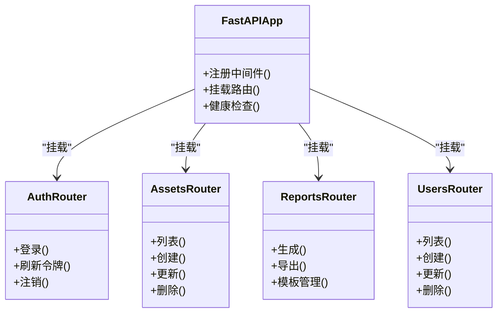

图表来源
- [backend/app/main.py](file://backend/app/main.py)
- [backend/app/api/v1/auth.py](file://backend/app/api/v1/auth.py)
- [backend/app/api/v1/assets.py](file://backend/app/api/v1/assets.py)
- [backend/app/api/v1/reports.py](file://backend/app/api/v1/reports.py)
- [backend/app/api/v1/users.py](file://backend/app/api/v1/users.py)
- [backend/app/schemas.py](file://backend/app/schemas.py)

章节来源
- [backend/app/main.py](file://backend/app/main.py)
- [backend/app/api/v1/auth.py](file://backend/app/api/v1/auth.py)
- [backend/app/api/v1/assets.py](file://backend/app/api/v1/assets.py)
- [backend/app/api/v1/reports.py](file://backend/app/api/v1/reports.py)
- [backend/app/api/v1/users.py](file://backend/app/api/v1/users.py)
- [backend/app/schemas.py](file://backend/app/schemas.py)

### 认证与安全
- 使用 JWT 实现无状态鉴权，密码采用安全哈希存储
- 安全模块提供令牌签发、校验、过期策略与权限判断
- 前端在登录后保存令牌并在后续请求中携带

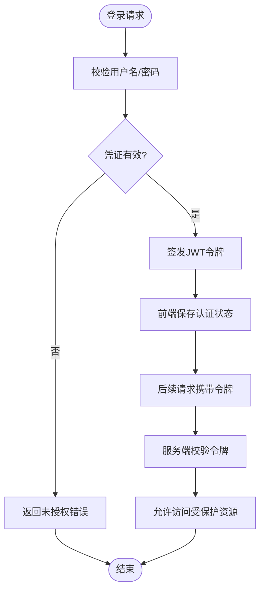

图表来源
- [backend/app/api/v1/auth.py](file://backend/app/api/v1/auth.py)
- [backend/app/core/security.py](file://backend/app/core/security.py)
- [frontend/src/stores/auth.ts](file://frontend/src/stores/auth.ts)

章节来源
- [backend/app/api/v1/auth.py](file://backend/app/api/v1/auth.py)
- [backend/app/core/security.py](file://backend/app/core/security.py)
- [frontend/src/stores/auth.ts](file://frontend/src/stores/auth.ts)

### 资产管理
- 提供资产的增删改查与批量导入能力
- 前端通过列表页展示资产信息，支持搜索与分页
- 后端通过数据库模型与 ORM 进行数据存取

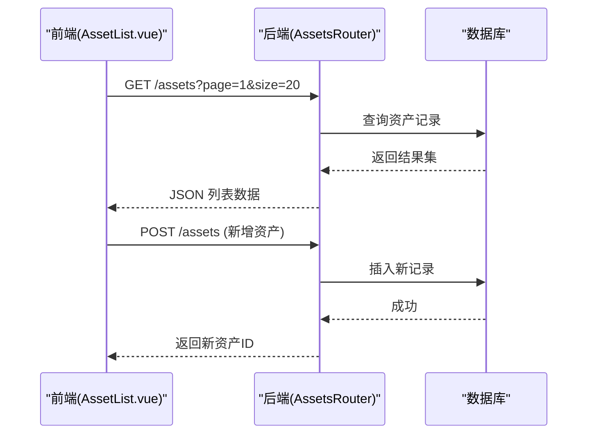

图表来源
- [backend/app/api/v1/assets.py](file://backend/app/api/v1/assets.py)
- [backend/app/db.py](file://backend/app/db.py)
- [frontend/src/views/AssetList.vue](file://frontend/src/views/AssetList.vue)

章节来源
- [backend/app/api/v1/assets.py](file://backend/app/api/v1/assets.py)
- [backend/app/db.py](file://backend/app/db.py)
- [frontend/src/views/AssetList.vue](file://frontend/src/views/AssetList.vue)

### 漏洞管理
- 漏洞条目编辑与详情查看，支持富文本描述与附件上传
- 列表页支持按标签、严重等级、状态筛选
- 与资产关联，形成漏洞与资产的关系映射

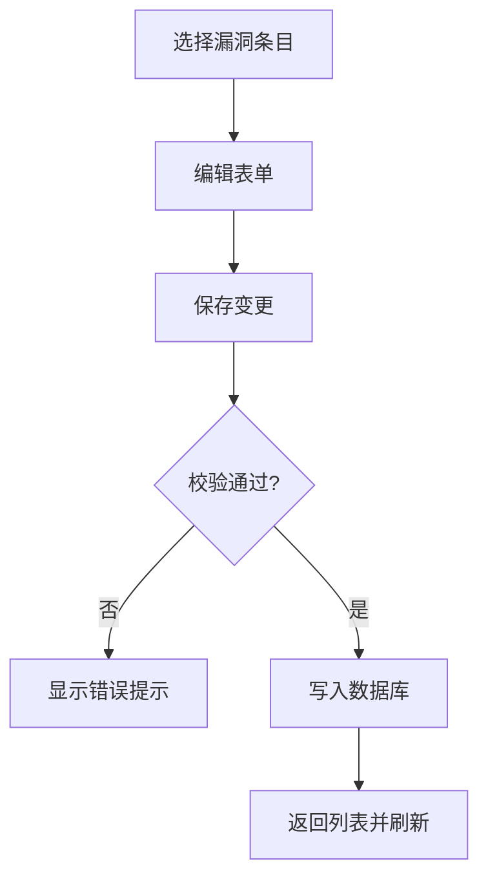

图表来源
- [backend/app/api/v1/vulns.py](file://backend/app/api/v1/vulns.py)
- [frontend/src/views/VulnList.vue](file://frontend/src/views/VulnList.vue)

章节来源
- [backend/app/api/v1/vulns.py](file://backend/app/api/v1/vulns.py)
- [frontend/src/views/VulnList.vue](file://frontend/src/views/VulnList.vue)

### 报告生成
- 支持模板渲染与文档导出（如 Word/PDF）
- 生成过程可能耗时，采用异步 Worker 处理，避免阻塞主线程
- 前端轮询或回调获取报告下载链接

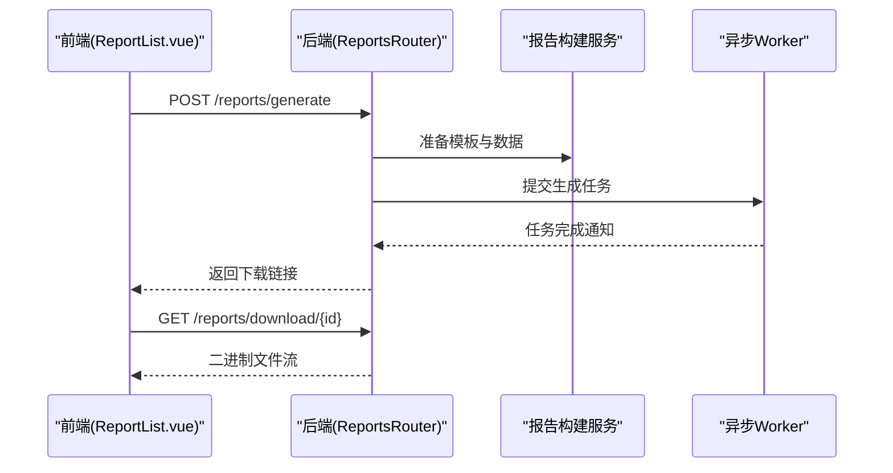

图表来源
- [backend/app/api/v1/reports.py](file://backend/app/api/v1/reports.py)
- [backend/app/services/report_builder.py](file://backend/app/services/report_builder.py)
- [backend/app/workers/main.py](file://backend/app/workers/main.py)
- [frontend/src/views/ReportList.vue](file://frontend/src/views/ReportList.vue)

章节来源
- [backend/app/api/v1/reports.py](file://backend/app/api/v1/reports.py)
- [backend/app/services/report_builder.py](file://backend/app/services/report_builder.py)
- [backend/app/workers/main.py](file://backend/app/workers/main.py)
- [frontend/src/views/ReportList.vue](file://frontend/src/views/ReportList.vue)

### 用户管理
- 用户增删改查、角色与权限分配
- 管理员可通过用户列表进行账号生命周期管理

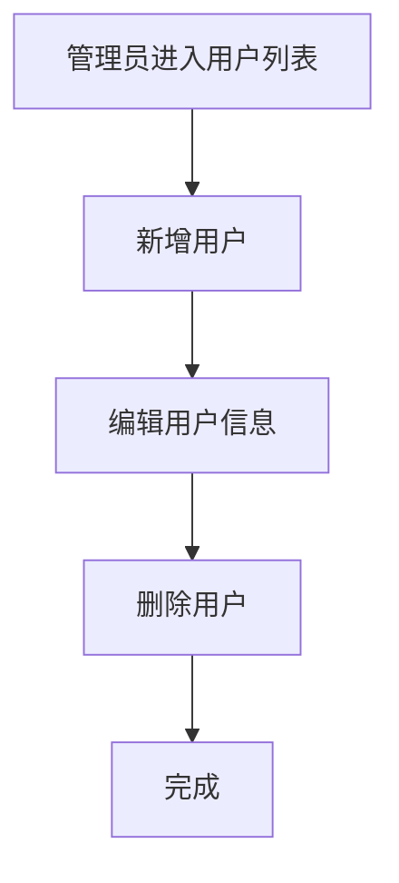

图表来源
- [backend/app/api/v1/users.py](file://backend/app/api/v1/users.py)
- [frontend/src/views/UserList.vue](file://frontend/src/views/UserList.vue)

章节来源
- [backend/app/api/v1/users.py](file://backend/app/api/v1/users.py)
- [frontend/src/views/UserList.vue](file://frontend/src/views/UserList.vue)

### 前端路由与页面
- 使用 Vue Router 管理页面路由，集中配置导航与权限守卫
- 各页面组件对应业务模块，清晰划分职责

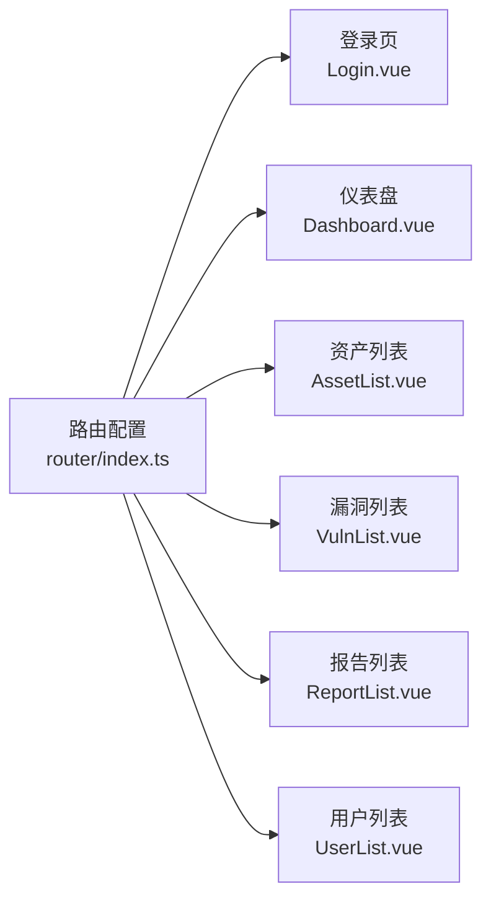

图表来源
- [frontend/src/router/index.ts](file://frontend/src/router/index.ts)
- [frontend/src/views/Dashboard.vue](file://frontend/src/views/Dashboard.vue)
- [frontend/src/views/AssetList.vue](file://frontend/src/views/AssetList.vue)
- [frontend/src/views/VulnList.vue](file://frontend/src/views/VulnList.vue)
- [frontend/src/views/ReportList.vue](file://frontend/src/views/ReportList.vue)
- [frontend/src/views/UserList.vue](file://frontend/src/views/UserList.vue)

章节来源
- [frontend/src/router/index.ts](file://frontend/src/router/index.ts)
- [frontend/src/views/Dashboard.vue](file://frontend/src/views/Dashboard.vue)
- [frontend/src/views/AssetList.vue](file://frontend/src/views/AssetList.vue)
- [frontend/src/views/VulnList.vue](file://frontend/src/views/VulnList.vue)
- [frontend/src/views/ReportList.vue](file://frontend/src/views/ReportList.vue)
- [frontend/src/views/UserList.vue](file://frontend/src/views/UserList.vue)

### 前端状态与 API 客户端
- 认证状态集中管理，登录后持久化令牌并注入到请求头
- 统一的 HTTP 客户端封装，简化错误处理与重试逻辑

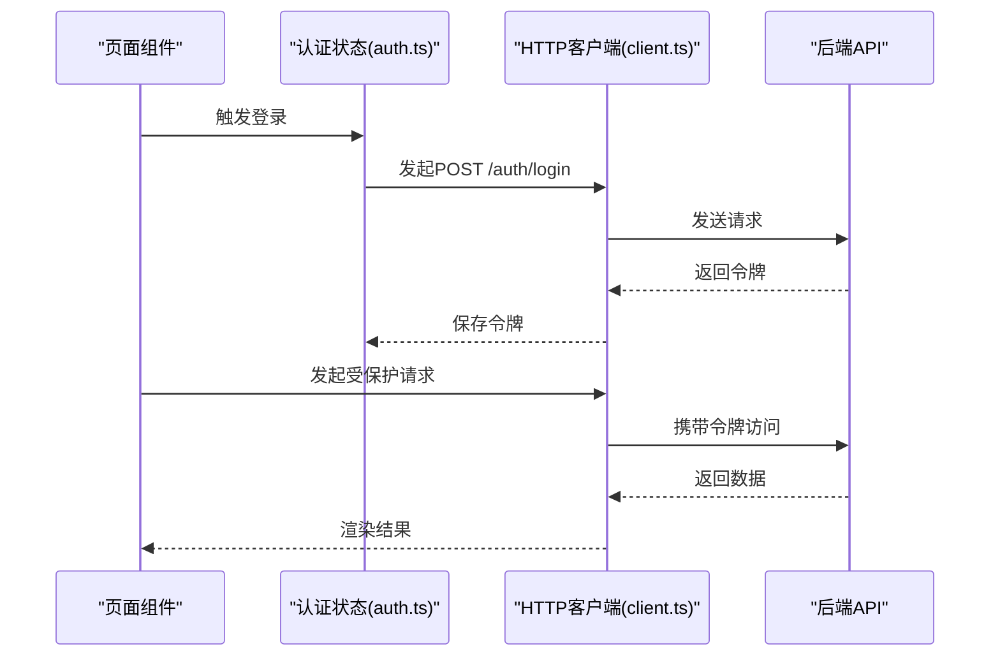

图表来源
- [frontend/src/stores/auth.ts](file://frontend/src/stores/auth.ts)
- [frontend/src/api/client.ts](file://frontend/src/api/client.ts)
- [backend/app/api/v1/auth.py](file://backend/app/api/v1/auth.py)

章节来源
- [frontend/src/stores/auth.ts](file://frontend/src/stores/auth.ts)
- [frontend/src/api/client.ts](file://frontend/src/api/client.ts)
- [backend/app/api/v1/auth.py](file://backend/app/api/v1/auth.py)

## 依赖关系分析
- 后端依赖：FastAPI、Pydantic、SQLAlchemy、Alembic、异步任务框架（如 Celery/RQ）、数据库驱动
- 前端依赖：Vue3、TypeScript、Vite、TailwindCSS、HTTP 客户端库
- 容器化依赖：Docker、Nginx、数据库镜像（如 PostgreSQL/MySQL）

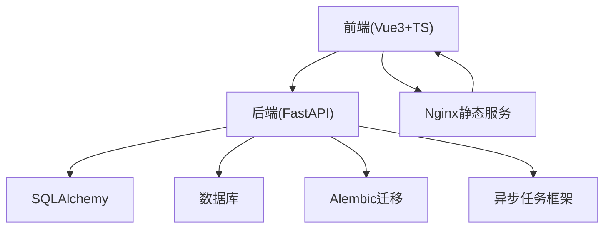

图表来源
- [backend/app/db.py](file://backend/app/db.py)
- [backend/app/main.py](file://backend/app/main.py)
- [frontend/src/router/index.ts](file://frontend/src/router/index.ts)
- [docker-compose.yml](file://docker-compose.yml)

章节来源
- [backend/app/db.py](file://backend/app/db.py)
- [backend/app/main.py](file://backend/app/main.py)
- [frontend/src/router/index.ts](file://frontend/src/router/index.ts)
- [docker-compose.yml](file://docker-compose.yml)

## 性能考量
- 使用 FastAPI 的异步特性提升 I/O 密集型请求吞吐
- 报告生成等耗时任务下沉至异步 Worker，避免阻塞主进程
- 数据库查询优化：分页、索引、缓存热点数据
- 前端懒加载与路由按需加载，减少首屏体积
- 合理设置 Nginx 缓存与压缩，提高静态资源传输效率

[本节为通用指导，不直接分析具体文件]

## 故障排查指南
- 认证失败：检查 JWT 配置、令牌有效期、跨域设置
- 数据库连接异常：确认数据库地址、端口、凭据与网络连通性
- 报告生成失败：查看 Worker 日志、模板路径与权限
- 前端无法访问后端：检查 CORS、代理配置与端口映射
- 容器启动失败：检查 docker-compose 环境变量与镜像版本

章节来源
- [backend/app/core/security.py](file://backend/app/core/security.py)
- [backend/app/db.py](file://backend/app/db.py)
- [backend/app/workers/main.py](file://backend/app/workers/main.py)
- [docker-compose.yml](file://docker-compose.yml)

## 结论
Talos 漏洞管理平台通过前后端分离与容器化部署，提供了稳定、可扩展的安全资产管理与漏洞治理能力。FastAPI 的高性能与类型安全、Vue3 的现代前端体验、以及异步任务与数据库迁移的完善生态，共同构建了企业级可用的平台基础。建议在生产环境中结合监控、日志与备份策略，进一步提升系统的可靠性与可观测性。

[本节为总结性内容，不直接分析具体文件]

## 附录：快速开始
- 环境要求
  - Docker 与 docker-compose
  - 操作系统：Linux/macOS/Windows（WSL2）
- 安装步骤
  - 克隆仓库并进入项目根目录
  - 配置环境变量（数据库、JWT 密钥、CORS 等）
  - 使用 docker-compose 启动服务
  - 首次运行执行数据库迁移（Alembic）
- 基本使用示例
  - 访问前端页面，使用默认管理员账号登录
  - 在资产列表中新增资产，绑定漏洞条目
  - 生成报告并下载导出文件
  - 在用户管理中新增普通用户并分配权限

章节来源
- [docker-compose.yml](file://docker-compose.yml)
- [backend/Dockerfile](file://backend/Dockerfile)
- [frontend/Dockerfile](file://frontend/Dockerfile)
- [backend/app/core/config.py](file://backend/app/core/config.py)
- [backend/app/db.py](file://backend/app/db.py)
- [frontend/src/views/Login.vue](file://frontend/src/views/Login.vue)