# Talos 漏洞管理系统 —— 功能介绍与使用说明（团队内部版）

> 适用读者：安全工程师、研发人员、测试人员、系统管理员及需要了解平台的管理人员。
> 文档基于 Talos v0.6.0 编写，界面截图取自实际运行环境。

---

## 目录

1. [系统概述与整体架构](#1-系统概述与整体架构)
2. [核心功能模块介绍](#2-核心功能模块介绍)
3. [详细使用步骤说明](#3-详细使用步骤说明)
4. [管理员功能操作指南](#4-管理员功能操作指南)
5. [常见问题解答（FAQ）](#5-常见问题解答faq)
6. [故障排除指南](#6-故障排除指南)
7. [附录：字典与权限点速查](#7-附录字典与权限点速查)

---

## 1. 系统概述与整体架构

### 1.1 系统定位

Talos（塔罗斯）是一套**漏洞全生命周期管理平台**，覆盖「漏洞发现 → 录入 → 确认 → 修复跟踪 → 复测 → 闭环」的完整流程，并提供测试计划管理、渗透测试报告在线编辑与导出、资产台账、安全态势可视化等能力。平台前身为「洞察2.0（insight2）」，现已基于 FastAPI + Vue 3 全量重构。

### 1.2 技术架构

```
┌────────────────────────  浏览器  ────────────────────────┐
│   Vue 3 + TypeScript + Element Plus + Tailwind CSS       │
│   Pinia 状态管理 · Vue Router · ECharts 图表 · TipTap 编辑器 │
└──────────────────────────┬───────────────────────────────┘
                           │ HTTPS / JSON（JWT 认证）
┌──────────────────────────▼───────────────────────────────┐
│                后端 API（Python FastAPI）                  │
│   Pydantic v2 校验 · SQLAlchemy 2.0 异步 ORM · Alembic 迁移 │
│   服务层：状态机 / docx 解析 / 报告构建 / 导出               │
└──────┬──────────────┬──────────────┬─────────────────────┘
       │              │              │
┌──────▼─────┐ ┌──────▼─────┐ ┌──────▼──────────┐
│ PostgreSQL │ │   Redis    │ │    Gotenberg    │
│ 16（主库） │ │ 缓存/队列  │ │ DOCX→PDF 转换   │
└────────────┘ └─────┬──────┘ └─────────────────┘
                     │
              ┌──────▼─────┐
              │ arq Worker │  后台异步任务（导入解析、导出等）
              └────────────┘
```

| 层 | 技术选型 | 说明 |
|---|---|---|
| 前端 | Vue 3 · TypeScript · Vite · Pinia · Element Plus · Tailwind CSS · ECharts · TipTap 2 | 单页应用，菜单/按钮按权限点动态渲染，支持明/暗双主题 |
| 后端 | Python 3.12 · FastAPI · Pydantic v2 · SQLAlchemy 2.0（async）· Alembic | RESTful API，接口文档见 `/api/docs`（生产环境关闭） |
| 数据库 | PostgreSQL 16（生产）/ SQLite（本地开发） | 通过 `VP_DATABASE_URL` 切换 |
| 队列 | Redis + arq | Redis 不可用时自动降级为进程内执行 |
| 文档处理 | python-docx（解析）· htmldocx（导出）· Gotenberg（PDF 转换） | Word 导入与报告导出的核心链路 |
| 部署 | Docker Compose（api / worker / frontend / postgres / redis / gotenberg） | 一条命令拉起全部服务 |

### 1.3 访问入口

| 环境 | 前端入口 | API 文档 |
|---|---|---|
| 生产（Docker Compose） | `http://<服务器IP>`（80 端口） | 生产环境已关闭 |
| 本地开发 | `http://localhost:27014` | `http://localhost:27015/api/docs` |

默认管理员账号 `admin`，初始密码由部署时的 `VP_INITIAL_ADMIN_PASSWORD` 指定（未指定则随机生成并仅在启动日志显示一次），**首次登录会强制修改密码**。

---

## 2. 核心功能模块介绍

### 2.1 漏洞管理（发现、分类、修复跟踪）

漏洞管理是平台的核心，主菜单「漏洞管理」进入。

**漏洞分类维度**：

| 维度 | 可选值 |
|---|---|
| 等级 | 严重（导出报告时映射为「超危」）/ 高危 / 中危 / 低危 / 安全 |
| 类型 | SQL注入、XSS跨站、命令执行、代码执行、文件包含、任意文件操作、权限绕过、逻辑漏洞、存在后门、信息泄露、文件上传、弱口令、威胁情报、其他 |
| 来源 | 安全部 / SRC / 众测 / 公众平台 / 合作伙伴 / Word导入 |
| 所在层 | 代码 / 运维 |

**状态机流转**（全程操作日志审计）：

```
未修复 ──(关联生成报告，自动)──► 修复中 ──(点击复测，自动)──► 复测中
  │                                                          │
  ├──► 已忽略（可回退未修复）                                  ├──► 已修复（闭环）
  └──► 暂不处理（可回退未修复 / 转修复中）                      └──► 复测未通过 → 回到修复中
```

> 「复测未通过」是展示层状态：漏洞回退到修复中且带有复测记录时，列表会显示为「复测未通过」。

**关键能力**：

- 单条 / 批量提交漏洞，支持一次提交多个漏洞块并共用测试目标（资产）
- 漏洞与资产多对多关联，归属部门由关联资产自动聚合
- 富文本描述 / 复现步骤 / 修复建议（支持表格、图片、代码块）
- 独立的「复测处理」页面，支持多条复测记录的增删改，自动聚合到漏洞复测详情
- 延期处理（记录延期天数与原因）、操作日志全程留痕
- 漏洞状态与关联报告、测试计划**双向同步**：漏洞全部闭环后报告自动标记完成；漏洞回退未修复时报告回退草稿、测试计划回退「复测中」并重开复测轮次

### 2.2 用户认证与权限管理

- **JWT 双令牌认证**：Access Token + Refresh Token，令牌带版本号，修改密码或禁用账号后全部存量令牌立即失效
- **登录防爆破**：同一用户名 + IP 登录失败达到阈值后锁定一段时间（默认 5 次 / 15 分钟，可通过 `VP_LOGIN_MAX_FAILURES` / `VP_LOGIN_LOCK_SECONDS` 调整）
- **强制改密**：首次登录或被管理员重置密码后，弹出不可关闭的改密弹窗（新密码至少 8 位）
- **RBAC 角色-权限点模型**：内置三个角色，可自建角色并自由勾选权限点

| 内置角色 | 权限 |
|---|---|
| 超级管理员 | 全部权限（`*`） |
| 安全工程师 | 态势查看、资产管理、漏洞提交/审核/管理、导入管理、报告管理 |
| 研发人员 | 态势查看、漏洞提交 |

前端按权限点控制菜单与按钮的显示，后端接口按权限点二次校验。

### 2.3 报告生成与导出

主菜单「报告中心」，三种建报方式：

1. **Word 导入**：按固定模板上传渗透测试报告 docx，后台自动解析出漏洞（含图片提取），批次预览、修正后确认批量入库
2. **从漏洞生成**：选择已有漏洞一键生成报告章节
3. **新建空白报告**：从零开始在线编辑

**在线编辑器**（TipTap 富文本）：

- 支持表格、图片、代码块、引用、列表等
- 自动保存 + 乐观锁版本号，防止多人编辑冲突
- 章节导航栏：点击平滑滚动定位，高亮当前章节
- 漏洞章节头部提供等级 / 类型 / 所在层 / 状态四个下拉框，修改即时保存到漏洞记录
- 可一键「插入漏洞章节」，把已有漏洞内容引入报告

**导出**：

- **Word（docx）**：使用渗透测试报告模板（封面 / 版本变更记录 / 适用性声明 / 目录 / 测试目标 / 风险汇总统计 / 风险详情自动填充），目录页码在 Word 中打开时自动刷新
- **PDF**：经 Gotenberg（LibreOffice 引擎）转换，与 Word 版式一致；未部署 Gotenberg 时仅 PDF 功能提示不可用，其余功能不受影响
- 导出记录留档，可在线预览、重复下载

### 2.4 测试计划与专项管理

- **测试计划**：登记被测系统、测试类型、所属部门、测试人员（认领机制）、预估/实际人天；支持 Excel 模板导入与导出（明细 + 统计汇总双 sheet）；统计概览与筛选条件联动（初测/复测次数、人天合计、按状态与月度漏洞分布）
- 计划内可直接「录入漏洞」「生成报告」，漏洞统计（超/高/中/低）自动汇总
- **专项管理**：远程检测、春耕行动等专项台账

### 2.5 资产与组织管理

- 统一资产模型：系统命名 / 子系统 / 部门 / 公网URL（互联网、办公网标签）/ 内网URL / 端口 / 服务 / 中间件 / 数据库 / 多负责人
- Excel 批量导入 / 导出、导入模板下载
- 漏洞提交页可远程搜索资产，无匹配时弹窗新建并自动回填
- 组织（用户组）管理页维护部门/分组

### 2.6 系统配置管理

所有后端配置统一使用 `VP_` 前缀的环境变量（写入 `.env` 或容器环境注入），核心项：

| 变量 | 说明 |
|---|---|
| `VP_SECRET_KEY` | JWT 签名密钥，生产环境必须为 ≥32 字符随机值，否则拒绝启动 |
| `VP_DATABASE_URL` | 数据库连接串（PostgreSQL / SQLite） |
| `VP_REDIS_URL` | Redis 地址，不可用时自动降级 |
| `VP_GOTENBERG_URL` | PDF 转换服务地址（默认 `http://localhost:3000`） |
| `VP_CORS_ORIGINS` | CORS 白名单 |
| `VP_INITIAL_ADMIN_PASSWORD` | 内置 admin 初始口令 |
| `VP_LOGIN_MAX_FAILURES` / `VP_LOGIN_LOCK_SECONDS` | 登录防爆破阈值 |
| `VP_REPORT_TEMPLATE` | 自定义 Word 报告模板路径 |
| `VP_DISABLE_QUEUE` | 置 1 时禁用队列（本地开发免 Redis） |

完整样例见仓库根目录 [.env.example](../.env.example)。

### 2.7 日志记录与监控

- **操作日志**：每条漏洞的创建、编辑、状态流转、延期、复测记录增删均写入日志，详情页可查（操作人 / 动作 / 备注 / 时间）
- **后端运行日志**：基于 Python 标准库 logging 输出到容器 stdout，可用 `docker compose logs -f api` 查看
- **安全态势 Dashboard**：漏洞总数、未闭环数、修复率、在管资产四大指标卡；近 12 个月趋势、等级/状态/类型分布、各部门安全概况，支持时间范围 / 部门 / 来源 / 等级多维筛选

---

## 3. 详细使用步骤说明

### 3.1 登录与账户设置

**登录流程**：

1. 浏览器打开平台地址，进入登录页
2. 输入用户名、密码，点击「登录」
3. 首次登录（或密码被重置后）会弹出**强制改密弹窗**：输入新密码（至少 8 位）确认后方可继续使用

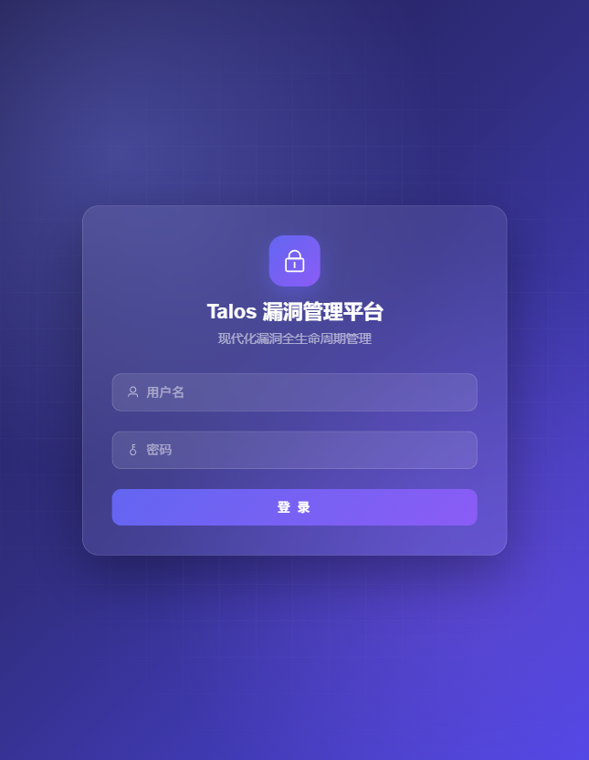

**账户设置**：

- 点击右上角**头像/姓名**，下拉菜单中可修改密码、退出登录
- 顶栏**月亮/太阳图标**：一键切换明 / 暗主题（选择会记住）
- 侧边栏底部折叠按钮：收起为图标模式，适合小屏幕

> 连续输错密码达到阈值（默认 5 次）会被临时锁定约 15 分钟，请勿反复尝试，可联系管理员重置密码。

登录成功后默认进入「安全态势」首页：

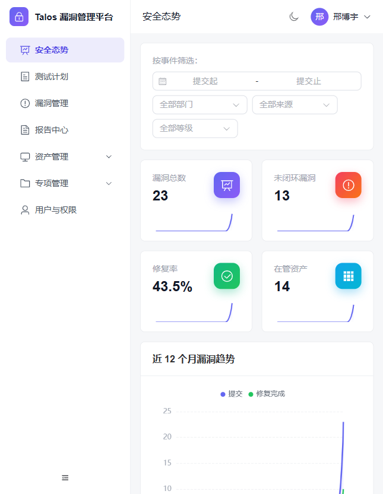

### 3.2 漏洞录入与编辑

**录入漏洞**：

1. 进入「漏洞管理」，点击右上角「+ 提交漏洞」
2. **测试目标**：搜索并选择资产（系统）。若资产不存在，点击旁边「新增资产」弹窗创建，创建后自动选中
3. 填写漏洞名称（必填），选择等级 / 类型 / 所在层，填写影响 URL
4. 在「漏洞描述」「复现步骤」「修复建议」三个富文本框中填写详情，工具栏支持加粗、代码块、表格、粘贴/上传截图等
5. 需要一次提交多个漏洞时，点击底部「新增漏洞」追加漏洞块（共用已选资产），最后点击「提交 N 个漏洞」

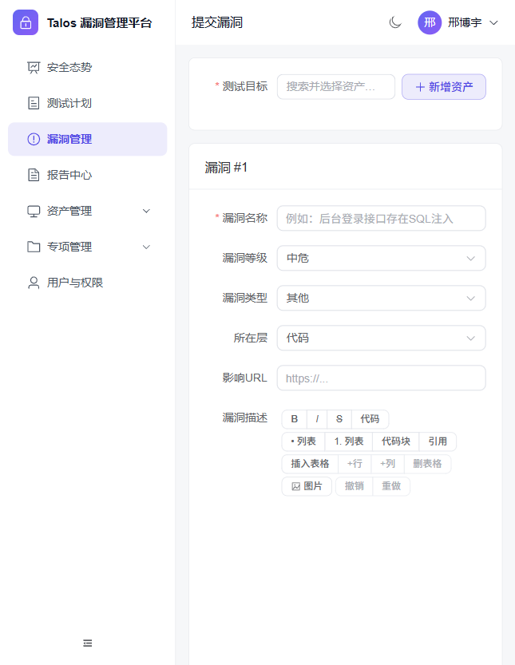

**编辑漏洞**：进入漏洞详情页点击「编辑」，或在列表中点击对应行进入详情。只有**提交人本人**或拥有 `vuln:manage` 权限的用户可以编辑。

### 3.3 搜索与筛选

漏洞列表顶部提供组合筛选，多个条件同时生效：

- **搜索框**：按漏洞标题或影响 URL 模糊匹配
- **状态 / 等级 / 类型**下拉：按对应字典筛选
- **只看我提交的**：勾选后只显示当前用户提交的漏洞
- 列表底部分页，每页默认 20 条

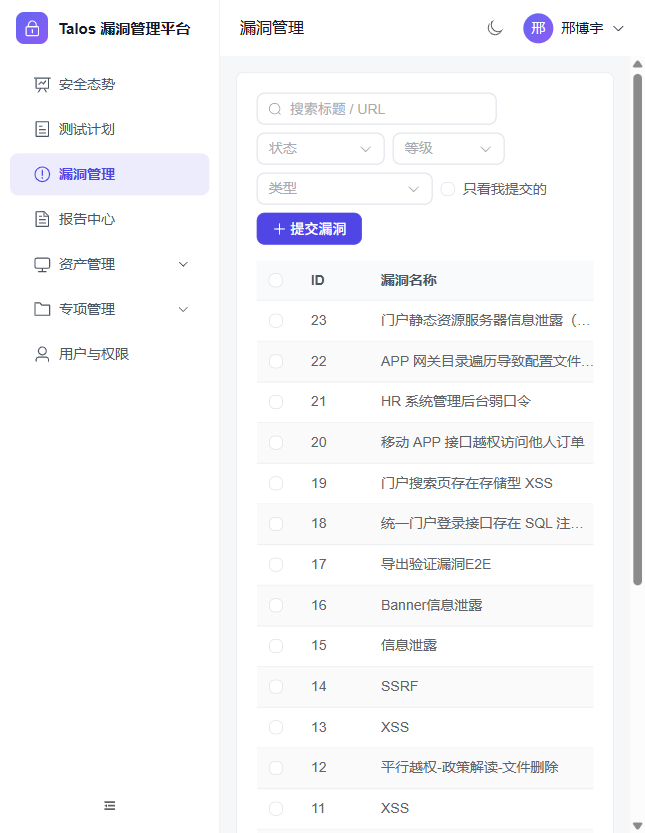

> 资产列表、报告列表、测试计划列表均有各自的搜索/筛选框，用法一致。

### 3.4 查看漏洞详情与状态流转

点击列表中的漏洞进入详情页，可看到：

- 顶部：标题、等级/类型/状态标签、来源、「编辑」按钮
- 基本信息：影响 URL、关联资产、测试计划、风险评分、各时间节点
- 正文：漏洞描述、复现步骤、修复建议
- **状态流转**：填写处理意见（可选）后点击目标状态按钮流转（需要 `vuln:audit` 权限，按钮仅显示当前状态允许流转到的目标）
- **操作日志**：完整记录每一次操作

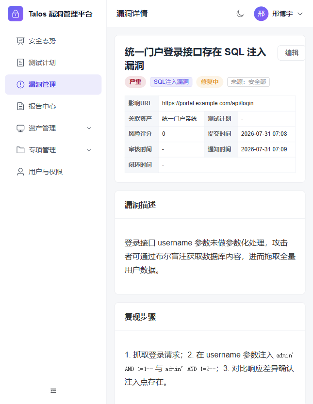

**复测处理**：对处于「复测中」的漏洞，可从详情或测试计划进入「复测处理」页，新增复测记录（富文本），复测通过则流转「已修复」，未通过则回退「修复中」。

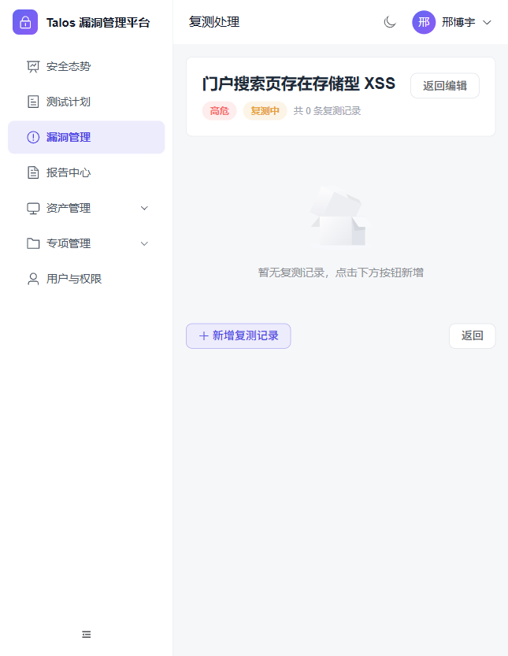

### 3.5 报告查看与下载

1. 进入「报告中心」，列表展示所有报告（标题、项目、作者、状态、版本、更新时间）

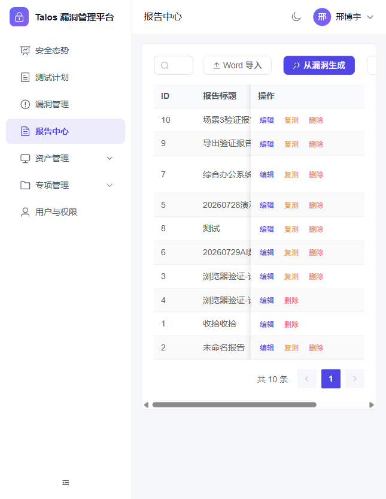

2. 点击某条报告的「编辑」进入在线编辑器：
   - 左侧填写报告信息（标题、系统名称、归属单位、作者、测试周期、被测系统IP）
   - 中间为分章节的富文本内容，漏洞章节头部可直接调整等级/类型/状态
   - 右侧「章节导航」快速跳转，「操作」区可保存、切换报告状态（草稿/已定稿/已完成）
3. **下载报告**：右侧点击「导出 Word」或「导出 PDF」，任务完成后在「导出记录」中「预览」或「下载」

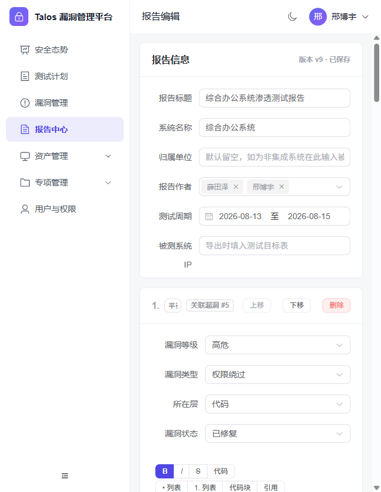

**Word 导入建报**：报告中心点击「Word 导入」，进入导入中心上传符合模板的 docx 文件；解析完成后进入预览页核对/修正漏洞条目，确认后批量入库并生成报告。

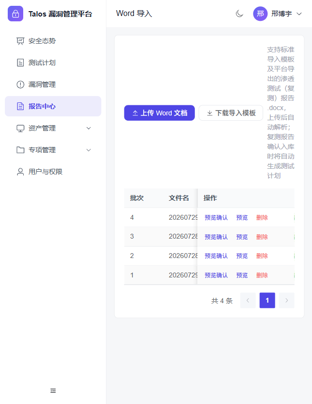

### 3.6 资产管理操作

1. 进入「资产管理 → 资产台账」
2. 「新建资产」填写系统命名、子系统、部门、公网/内网 URL、端口、负责人等
3. 批量维护：点击「下载模板」获取 Excel 模板，填好后「导入Excel」；也可「导出Excel」备份
4. 已有资产可「编辑」「删除」

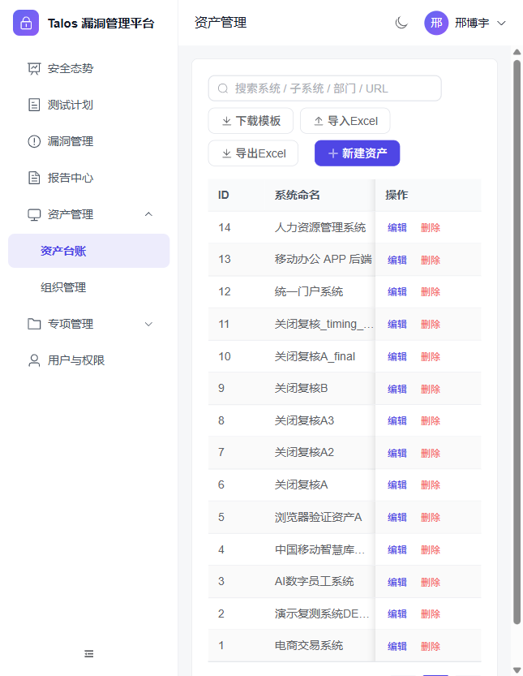

### 3.7 测试计划操作

1. 进入「测试计划」，顶部「统计概览」随筛选条件实时更新
2. 「新增测试计划」登记被测系统、类型、部门、人员、预估人天等
3. 测试人员点击「认领」后成为该计划的负责人，方可录入漏洞
4. 计划行内「录入漏洞」「生成报告」快速联动；「导入Excel」「导出Excel」支持批量与统计导出

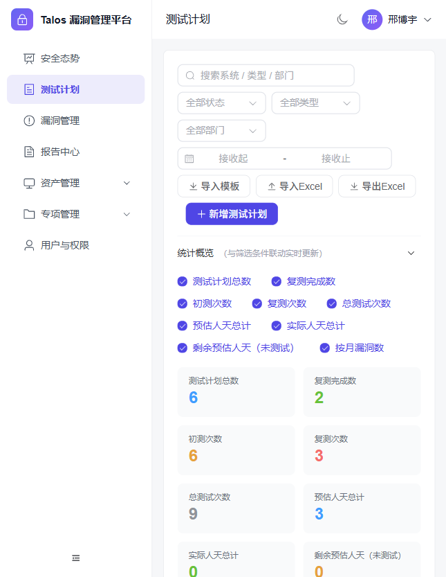

---

## 4. 管理员功能操作指南

管理员（超级管理员或具备 `user:manage` 权限）通过主菜单「用户与权限」进行管理。

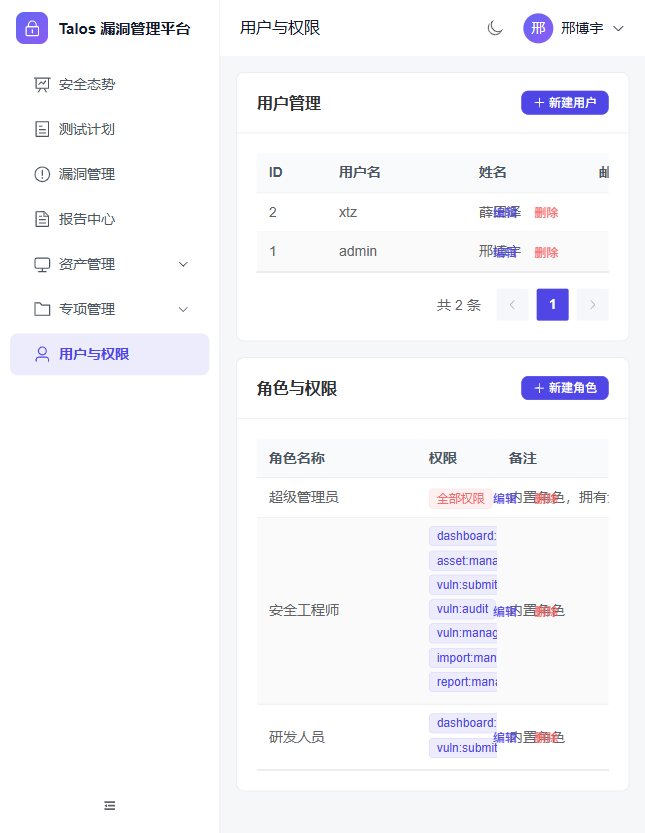

### 4.1 用户管理

- **新建用户**：点击「新建用户」，填写用户名、姓名、邮箱、初始密码、分配角色。新用户首次登录会被强制改密
- **编辑用户**：修改姓名/邮箱/角色，或**禁用账号**（禁用后该用户全部令牌立即失效，无法登录）
- **重置密码**：编辑用户时重置密码，用户下次登录被强制改密
- **删除用户**：谨慎操作，删除后不可恢复

### 4.2 角色与权限管理

- 页面下半部分为「角色与权限」列表，展示每个角色的权限点
- **新建角色**：填写角色名称、备注，勾选需要的权限点（见附录）
- 内置角色（超级管理员/安全工程师/研发人员）建议保留，按需新建自定义角色

### 4.3 系统级配置

系统运行参数通过环境变量管理（见 [2.6 系统配置管理](#26-系统配置管理)），由运维在部署时通过 `.env` 或 `docker-compose.yml` 配置，**修改后需重启对应服务生效**。生产环境务必：

- 设置强随机 `VP_SECRET_KEY`（≥32 字符）
- 修改数据库口令
- 首次登录后立即修改 admin 密码
- 将 Gotenberg 置于内网、不对外暴露端口

---

## 5. 常见问题解答（FAQ）

**Q1：忘记密码怎么办？**
A：平台暂无自助找回，请联系管理员在「用户与权限」中重置你的密码，重置后用新密码登录并按提示改密。

**Q2：为什么我看不到某些菜单/按钮（如「用户与权限」「删除」）？**
A：菜单和按钮按角色权限点显示。你的角色没有对应权限点时不会显示，请联系管理员调整角色权限。

**Q3：登录提示"登录失败次数过多，请稍后再试"？**
A：触发了防爆破锁定（默认 5 次失败锁定约 15 分钟）。请稍候再试，或联系管理员重置密码。

**Q4：导出 PDF 时提示"转换服务不可用"？**
A：PDF 依赖 Gotenberg 转换服务。请联系运维确认 Gotenberg 已部署且 `VP_GOTENBERG_URL` 配置正确。此问题不影响漏洞、报告、Word 导出等其他功能。

**Q5：Word 导入后漏洞没有解析出来 / 解析不全？**
A：导入要求**固定模板**。请确认上传的是符合模板的 docx（漏洞信息表格标签需与模板一致，如漏洞链接/漏洞证明/修复建议等）。可在预览页手工修正后再确认入库。

**Q6：为什么漏洞列表里出现了"复测未通过"，但字典里没有这个状态？**
A：这是展示层状态。当漏洞从"复测中"回退到"修复中"且已有复测记录时，列表会显示为"复测未通过"，实际存储状态仍是"修复中"。

**Q7：我改了漏洞状态，为什么关联的报告/测试计划状态也变了？**
A：这是设计的双向同步机制。漏洞全部闭环时报告自动标记完成；漏洞回退未修复时，报告回退草稿、测试计划回退"复测中"并重开复测轮次。

**Q8：测试计划里为什么不能录入漏洞？**
A：需要先「认领」该计划成为负责人（或由管理员操作）。未认领时录入漏洞会提示"请先认领该测试计划"。

**Q9：修改密码后其他设备被强制退出了？**
A：正常现象。改密会递增令牌版本号，使全部旧令牌失效，属于安全设计。

**Q10：本地开发需要装 PostgreSQL 和 Redis 吗？**
A：不需要。使用一键脚本 `dev.ps1`（Windows）/ `dev.sh`（Linux/macOS），默认走 SQLite + 免队列模式。

---

## 6. 故障排除指南

### 6.1 无法访问平台 / 页面白屏

1. 确认服务是否运行：Docker 环境执行 `docker compose ps`，本地开发确认前后端进程存活
2. 确认端口：生产前端 27012，本地前端 27014 / 后端 27015
3. 浏览器强制刷新（Ctrl+F5）清缓存；查看浏览器控制台是否有报错

### 6.2 登录成功但接口 401 / 一直跳回登录页

- 可能是 Access Token 过期或令牌失效（改密/被禁用）。重新登录即可
- 若刚部署后所有人都无法登录，检查后端是否因 `VP_SECRET_KEY` 不合规（生产环境要求 ≥32 字符）**启动失败**，查看后端日志

### 6.3 后端启动失败

| 现象 | 排查 |
|---|---|
| `VP_SECRET_KEY 必须为 >=32 字符` | 设置合规的 `VP_SECRET_KEY` |
| 数据库连接失败 | 检查 `VP_DATABASE_URL`、PostgreSQL 是否就绪、口令是否正确 |
| Redis 连接告警 | 非致命，会自动降级为进程内队列；如需队列请修复 `VP_REDIS_URL` |

查看后端日志：`docker compose logs -f api`（生产）；本地开发直接看 uvicorn 控制台输出。

### 6.4 PDF 导出失败（502 / 转换服务不可用）

1. 确认 Gotenberg 服务运行：`docker compose ps` 查看 gotenberg 容器
2. 确认 `VP_GOTENBERG_URL` 指向正确地址（Docker 内网为 `http://gotenberg:3000`）
3. 大文档转换超时时，可调大 `docker-compose.yml` 中 Gotenberg 的 `--api-timeout`（默认已设 120s）

### 6.5 前端本地开发启动报错

| 现象 | 处理 |
|---|---|
| `pnpm dev` 报 `ERR_PNPM_IGNORED_BUILDS` | pnpm v11+ 的构建脚本校验，追加 `--config.verify-deps-before-run=false`，或先执行 `pnpm approve-builds` 永久授权 |
| 端口被占用 | 用 `FRONTEND_PORT` / `BACKEND_PORT` 环境变量或 `dev.ps1` 的 `-FrontendPort` / `-BackendPort` 参数换端口 |

### 6.6 Word 导入解析异常

- 确认文件为 `.docx`（非 `.doc`）且符合模板
- 解析出的图片/字段缺失，可在预览页手动补全后确认
- 平台已用 `defusedxml` 加固 docx 解析防 XXE，非常规构造的文档可能被拒绝

---

## 7. 附录：字典与权限点速查

### 7.1 漏洞状态码

| 状态 | 含义 |
|---|---|
| 未修复 | 漏洞已录入，等待处理 |
| 已忽略 | 判定无需处理 |
| 暂不处理 | 暂缓，可回退未修复或转修复中 |
| 修复中 | 关联报告后自动进入 |
| 复测中 | 修复完成，等待复测 |
| 已修复 | 复测通过，闭环 |
| 复测未通过 | （展示层）复测中回退到修复中 |

### 7.2 权限点一览

| 权限点 | 说明 |
|---|---|
| `dashboard:view` | 查看安全态势 |
| `asset:manage` | 资产管理 |
| `vuln:submit` | 提交漏洞 |
| `vuln:audit` | 漏洞状态流转 / 审核 / 复测 |
| `vuln:manage` | 漏洞编辑（他人）/ 删除 / 延期 |
| `import:manage` | Word 导入管理 |
| `report:manage` | 报告管理 |
| `special:manage` | 专项管理 |
| `user:manage` | 用户与角色管理 |
| `system:manage` | 系统级配置管理 |

### 7.3 相关文档

- 部署与开发：[README.md](../README.md)
- 版本发布记录：[docs/RELEASE.md](RELEASE.md)
- 后续功能规划：[docs/ROADMAP.md](ROADMAP.md)

---

> 文档维护：如平台功能有更新，请同步更新本说明与截图（截图位于 `docs/images/`）。
